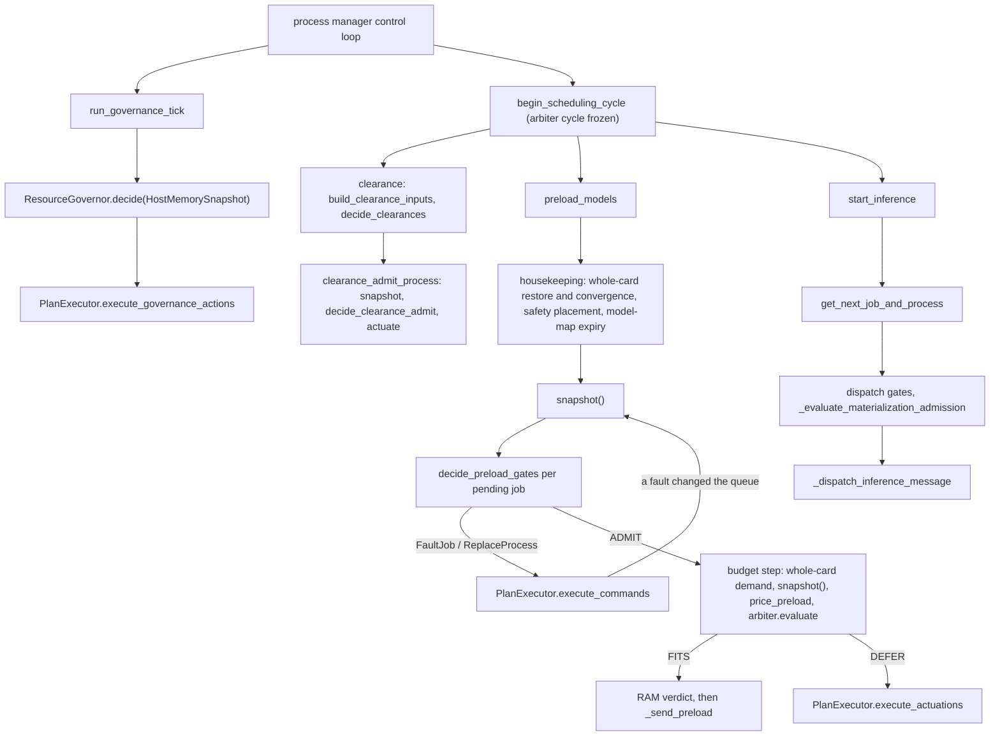
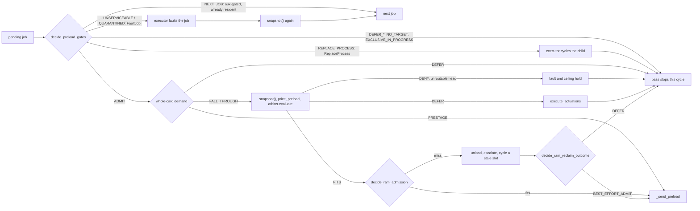

# Admission pipeline

How the worker decides, each control-loop iteration, which model to stage, which job to dispatch, and which
staged child to clear into its sample window. This page is the map for anyone changing preload, dispatch or
clearance behaviour: where each decision lives, what it reads, what it returns, and who acts on it.

## One shape for every decision

Three layers already decide without acting: the resource governor decides over a
[`HostMemorySnapshot`][horde_worker_regen.process_management.scheduling.governance.snapshots.HostMemorySnapshot]
and returns [`GovernanceAction`][horde_worker_regen.process_management.scheduling.governance.actions]
values; the [`VramArbiter`][horde_worker_regen.process_management.resources.vram_arbiter.VramArbiter]
evaluates a request against its frozen per-card measurement and returns a verdict carrying the actuations
it requires; the clearance lease decides over `ClearanceInputs`. The admission pipelines follow the same
shape, so a reader who has understood one has understood all of them:

1. **Freeze.** `InferenceScheduler.snapshot()` builds a
   [`SchedulingSnapshot`][horde_worker_regen.process_management.scheduling.admission.snapshot.SchedulingSnapshot]:
   every card, slot, queued job, model-map entry, ledger view and effective config field a gate reads,
   as values. The builder is the only place a collaborator is read.
2. **Decide.** A pure function in `scheduling/admission/` takes the snapshot and returns a plan: a
   decision, the slot it chose, the commands the decision requires. It never reads a collaborator and
   never sends a message.
3. **Execute.** The
   [`PlanExecutor`][horde_worker_regen.process_management.scheduling.admission.executor.PlanExecutor]
   runs the plan's commands and the verdict's actuations against the live worker through the
   [`ExecutionHost`][horde_worker_regen.process_management.scheduling.admission.executor.ExecutionHost]
   surface the scheduler implements. Ledger bookkeeping and log lines stay direct calls at the act site.
4. **Re-freeze at a phase boundary.** Where a decision has to act and then decide again against the
   changed card (a fault removed a job from the queue, a whole-card residency scaled the pool down), the
   pass takes a fresh snapshot behind the action instead of reading live state in between.

Parity with the previous inline sequencing is held by the golden traces (see below); the intended
differences are listed in each slice's commit.

## One scheduling cycle

## Where each decision lives

| Decision | Function | Reads | Returns | Acted on by |
| --- | --- | --- | --- | --- |
| Preload gate ladder (serviceable, quarantined, already resident, RAM floor, target, exclusive hold, growth hold, model change, load serialization) | [`decide_preload_gates`][horde_worker_regen.process_management.scheduling.admission.preload.decide_preload_gates] | `SchedulingSnapshot` | `PreloadGatePlan`: an `AdmissionDecision`, the target slot, `FaultJob` / `ReplaceProcess` commands, a once-per-episode notice | `InferenceScheduler._run_preload_plan`, `PlanExecutor.execute_commands` |
| Preload target choice (sticky, then least loaded, sparing the head's own copy) | [`select_preload_target`][horde_worker_regen.process_management.scheduling.admission.preload.select_preload_target], [`select_head_room_target`][horde_worker_regen.process_management.scheduling.admission.preload.select_head_room_target] | snapshot | a process id or None | the gate ladder |
| Preload budget pricing (predictive verdict, context-reduction depth, arbiter request) | [`price_preload`][horde_worker_regen.process_management.scheduling.admission.preload.price_preload] | snapshot, the frozen arbiter, the streaming forecast | `PricedPreload` | `_admit_preload_under_budget`, which evaluates through the arbiter and runs the RAM verdict or the actuations |
| RAM staging verdict (whole checkpoint, page-reuse credit, or the UNet-only component charge) | [`decide_ram_admission`][horde_worker_regen.process_management.scheduling.admission.preload.decide_ram_admission] | snapshot | `RamAdmission` | `_apply_ram_verdict`, which records the accounting on a fit and runs the reclaim sequence on a miss |
| Materialisation request (dispatch, clearance and preload share it) | [`build_materialization_request`][horde_worker_regen.process_management.scheduling.admission.materialization.build_materialization_request] | snapshot, the frozen arbiter | `MaterializationRequest` (the `VramRequest`, the context-reduction depth, the candidate delta) | `VramArbiter.evaluate` |
| VRAM pricing primitives (candidate delta, learned peaks, the streaming forecast, the co-resident maximum, what the card could give back) | [`pricing`][horde_worker_regen.process_management.scheduling.admission.pricing] | snapshot | numbers and predicates | every decision above |
| Clearance admit for a staged child | [`decide_clearance_admit`][horde_worker_regen.process_management.scheduling.admission.clearance.decide_clearance_admit] | snapshot, the frozen arbiter | `ClearancePlan` | `clearance_admit_process` |
| Host RAM governance | [`ResourceGovernor`][horde_worker_regen.process_management.scheduling.governance.governor.ResourceGovernor] | `HostMemorySnapshot` | `GovernanceAction` list | `PlanExecutor.execute_governance_actions` |
| Model serviceability (the pop offer and the preload gate share it) | [`model_serviceability_verdicts`][horde_worker_regen.process_management.resources.model_serviceability.model_serviceability_verdicts] | card runtimes, model metadata, the admission baseline | one verdict per serving card | the popper, the process manager's card report, the snapshot builder |

Still inline on the scheduler, and the next cuts in order: the whole-card residency demand
(`_decide_whole_card_demand`, which establishes residencies and unloads siblings inside the budget step),
the RAM reclaim sequence behind a RAM miss (`_apply_ram_verdict`), dispatch selection
(`get_next_job_and_process`) and the dispatch holds (`_dispatch_residency_reconciliation_holds`). Each is
actuation over the same collaborators and will take the same shape.

## One job through the preload pass

## Reading a preload decision back

Every exit of the pass is recorded once, as the final decision the job ended on:

- **The head-admission ledger** keeps the latest record
  (`InferenceScheduler.head_admission.last_preload_admission`: decision, model, target process, reason). The
  dispatch-stall line quotes it when it names the parked head's model, and the harness reads the budget
  defer reason from it.
- **The decision sink** receives a `VRAM_ADMISSION` event per job whose verdict is the decision's kind:
  `ADMIT` for a sent preload, `NO_OP` for an already-resident model, `DENY` for a faulted (unserviceable or
  quarantined) job, `WITHHOLD` for a pass that moved on or stopped, and `DEFER` for every hold (RAM floor,
  growth hold, no target, exclusive hold, concurrency, budget). The sink coalesces repeats, so a head declined
  for the same reason every cycle costs one event.
- **Log lines**, each edge-triggered or coalesced: the RAM danger floor notice and the concurrency notice fire
  once per episode (the plan carries the text, the scheduler the latch); the arbiter's defer names its
  arithmetic and is coalesced on the stable reason (`VRAM arbiter deferring preload of ...`); the RAM budget's
  defer fires once until a fit (`RAM budget deferring preload of ...`); an unroutable head arms a ceiling hold
  with one warning per arm.
- **Run metrics** count the measured-floor denials (`admission_denials`): a candidate the static free-VRAM
  budget admitted and the measured arbiter refused.

## The state the decisions read

The scheduler's mutable state sits in five ledgers under `scheduling/ledgers/`, each with a frozen view on the
snapshot: [retention](../horde_worker_regen/process_management/scheduling/ledgers/retention.md) (cross-job
VRAM holds), [safety placement](../horde_worker_regen/process_management/scheduling/ledgers/safety_placement.md)
(the safety process on or off the GPU), [RAM reclaim](../horde_worker_regen/process_management/scheduling/ledgers/ram_reclaim.md)
(reuse credits and the stale-slot cycle clock), [head admission](../horde_worker_regen/process_management/scheduling/ledgers/head_admission.md)
(the head's starvation, RAM-defer and barrier clocks, the last preload admission) and
[dispatch holds](../horde_worker_regen/process_management/scheduling/ledgers/dispatch_holds.md) (per-job residency
holds and their counters). The whole-card residency machine lives in
[`governance/whole_card.py`][horde_worker_regen.process_management.scheduling.governance.whole_card]. A
decision reads the view; the act site updates the ledger.

## Rules that keep the shape

- **One measurement per phase.** The arbiter's cycle is frozen once per control-loop iteration
  (`begin_scheduling_cycle`); a scheduler exercised on its own re-primes a private arbiter, and
  `_ensure_preload_arbiter` runs before `snapshot()` so the card state and the verdict read one freeze.
  A decision never reads live free VRAM beside the arbiter's snapshot.
- **A decision returns values.** Commands
  ([`FaultJob`][horde_worker_regen.process_management.scheduling.admission.commands.FaultJob],
  [`ReplaceProcess`][horde_worker_regen.process_management.scheduling.admission.commands.ReplaceProcess]) are
  the actions a decision has to return; the executor is the only place they happen. Ledger updates and log
  lines are not commands: they stay direct calls at the act site, so the executor does not become a
  dispatch table of one-liners.
- **The decision recorded is the final one.** A gate plan the ladder admits can still defer at the budget,
  lose its target to a whole-card scale-down, or fail its send; `_run_preload_plan` records whichever
  decision the job actually ended on, into the head-admission ledger and the decision sink.
- **Every log line that can fire per tick is edge-triggered or coalesced** through
  [`DiagnosticThrottle`][horde_worker_regen.process_management.scheduling.diagnostic_throttle.DiagnosticThrottle]
  or a once-per-episode latch; the plan carries the notice text, the scheduler owns the latch.
- **The snapshot is cheap to build and built more than once per cycle.** The preload pass takes one, re-takes
  it behind a fault, and the budget step takes one after the whole-card demand may have acted. Do not cache a
  snapshot across an actuation.

## How to change something

- **Add a gate to the preload ladder.** Add the fact it reads to the snapshot (`snapshot.py`; the builder
  takes collaborators explicitly, and `test_scheduling_snapshot.py` pins each field) and the rung to
  `decide_preload_gates`, returning a plan with the right `AdmissionDecision`. Pin it in
  `test_admission_preload.py` as a plan assertion over `scheduler.snapshot()`. If the gate must act, add a
  command in `commands.py` and its one case in `PlanExecutor.execute_commands`.
- **Change a price.** Edit the `pricing` function; `test_admission_pricing.py` is its specification.
  A prediction a test needs pinned must be monkeypatched on every module that binds the name
  (`inference_scheduler`, `admission.pricing`, `admission.materialization`).
- **Change sequencing.** If a decision needs to see the result of an action, add a phase boundary
  (re-snapshot) rather than a live read inside the decision.
- **Prove parity.** `tests/process_management/liveness/test_golden_traces.py` replays ten dispatch-world
  scenarios and diffs their decision, resource-state, actuation and child-message traces against
  `golden/*.json`. A behaviour change that is intended regenerates them with `-m golden_regen` and explains
  the diff in the commit; anything else the diff surfaces is a regression.

## See also

- [Resource governance](resource_governance.md): the governor tick, whole-card residency and the RAM remedies.
- [VRAM arbiter](vram_arbiter.md): the measured admission identity, the verified reclaim ladder, retention.
- [Codebase map](../reference/codebase-map.md): file to responsibility.
