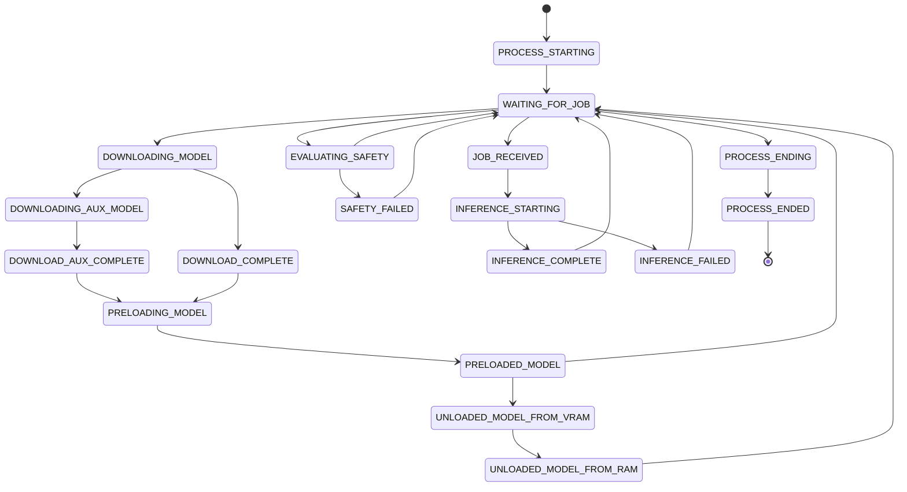

# IPC and Messaging

- [IPC and Messaging](#ipc-and-messaging)
    - [The two channels](#the-two-channels)
    - [Message type hierarchy](#message-type-hierarchy)
        - [Control messages (parent → child)](#control-messages-parent--child)
        - [Status messages (child → parent)](#status-messages-child--parent)
    - [Process state machine](#process-state-machine)
    - [Model load states](#model-load-states)
    - [The optimistic-send pattern](#the-optimistic-send-pattern)
    - [Discarding stale messages](#discarding-stale-messages)
    - [See also](#see-also)

The worker's parent process and its children communicate through a two-channel
IPC (Inter-Process Communication) system. Understanding the message types and the
optimistic-send pattern is essential for debugging state drift between parent and child.

## The two channels

| Direction      | Transport                             | Characteristics                |
| -------------- | ------------------------------------- | ------------------------------ |
| Parent → child | Per-process `multiprocessing.Pipe`    | Point-to-point, reliable, FIFO |
| Child → parent | Single shared `multiprocessing.Queue` | Many-to-one, reliable, FIFO    |

The parent sends **control messages** (`HordeControlMessage` subclasses) over
each child's dedicated pipe. All children send **status messages**
(`HordeProcessMessage` subclasses) into the same shared queue. The
`MessageDispatcher` drains this queue twice per control-loop iteration.

## Message type hierarchy

### Control messages (parent → child)

| Message                             | Purpose                             | Carries                                                                                            |
| ----------------------------------- | ----------------------------------- | -------------------------------------------------------------------------------------------------- |
| `HordePreloadInferenceModelMessage` | Ask a process to load a model       | Model name, download/load flags                                                                    |
| `HordeInferenceControlMessage`      | Start inference on a job            | Full `ImageGenerateJobPopResponse`                                                                 |
| `HordeAlchemyControlMessage`        | Run one alchemy form (`START_ALCHEMY`) | `AlchemyFormSpec` (form name, pre-downloaded base64 source image, optional R2 upload URL)       |
| `HordeSafetyControlMessage`         | Evaluate safety of completed images | Images + metadata                                                                                  |
| `HordeControlModelMessage`          | Unload model from RAM or VRAM       | Model name (direction set by `control_flag`: `UNLOAD_MODELS_FROM_VRAM` / `UNLOAD_MODELS_FROM_RAM`) |
| `HordeControlMessage`               | Generic control (flag only)         | A `HordeControlFlag` (e.g. `END_PROCESS`, `UNLOAD_MODELS_FROM_RAM`)                                |

The inference, preload, and alchemy control messages also carry an optional
`trace_context` (W3C traceparent) so the child's work spans correlate with the
parent's job span in logfire.

> Control messages are addressed point-to-point over a process's dedicated pipe,
> so unlike status messages they do **not** carry a `process_launch_identifier`;
> the pipe itself identifies the recipient. The launch identifier lives on the
> child→parent status messages (see below).

### Status messages (child → parent)

| Message                           | Sent when…                                   | Key fields                                                                            |
| --------------------------------- | -------------------------------------------- | ------------------------------------------------------------------------------------- |
| `HordeProcessStateChangeMessage`  | Process changes state                        | Old state, new state, model info                                                      |
| `HordeModelStateChangeMessage`    | Model load state changes                     | Model name, new `ModelLoadState`                                                      |
| `HordeAuxModelStateChangeMessage` | Auxiliary model state changes                | Aux model name, new state                                                             |
| `HordeProcessHeartbeatMessage`    | Periodic heartbeat (progress)                | `HordeHeartbeatType`, `percent_complete`, and (during sampling) `current_step` / `total_steps` / `iterations_per_second` |
| `HordeProcessMemoryMessage`       | Periodic memory report                       | `ram_usage_bytes`, `vram_usage_mb`, `vram_total_mb`                                    |
| `HordeInferenceResultMessage`     | Inference completes (success/fault/censored) | State, base64 images, timing, metadata                                                |
| `HordeAlchemyResultMessage`       | An alchemy form completes                    | `form_id`, `form`, state; `result_payload` (text forms) or `image_base64` (graph forms) |
| `HordeJobMetricsMessage`          | A job (or alchemy form) finishes             | `job_id`, `is_alchemy`, a `JobPhaseMetrics` snapshot (load timings, it/s, mem high-water) |
| `HordeDownloadMetricsMessage`     | Ad-hoc downloads (lora/ti) complete          | A list of `DownloadEvent` (name, size, MB/s, success)                                 |
| `HordeSafetyResultMessage`        | Safety check completes                       | `job_id` + per-image safety evaluations (NSFW/CSAM flags, optional replacement image) |

The two metrics messages (`HordeJobMetricsMessage`, `HordeDownloadMetricsMessage`)
carry the numbers from hordelib's in-process metrics collector into the main
process's run-metrics aggregator; see
[Architecture → Metrics and observability](architecture.md#metrics-and-observability).

## Process state machine

Each child process reports its own state via `HordeProcessStateChangeMessage`.
The states form a directed graph:



> The diagram above shows the primary transitions. Many intermediate states
> (e.g. `PRELOADED_MODEL`, `DOWNLOAD_AUX_COMPLETE`) can also transition directly
> back to `WAITING_FOR_JOB` or to `INFERENCE_STARTING`. The alchemy states
> (`ALCHEMY_STARTING` → `ALCHEMY_COMPLETE` / `ALCHEMY_FAILED`, reported by both
> inference and safety processes while running a form) and a few other edges are
> omitted for clarity; see
> [`_EXPECTED_PROCESS_STATE_SOURCES`][horde_worker_regen.process_management.lifecycle.process_map._EXPECTED_PROCESS_STATE_SOURCES]
> for the complete transition table.

`ProcessMap` tracks the current state of every process and validates transitions
against an expected-predecessor table (`_EXPECTED_PROCESS_STATE_SOURCES`).
Unexpected transitions are logged as warnings but never rejected; the child is
authoritative about its own state.

## Model load states

In parallel with the process state, each model the worker knows about has a
`ModelLoadState` tracked in `HordeModelMap`:

```
DOWNLOADING → ON_DISK → LOADING → LOADED_IN_RAM → LOADED_IN_VRAM → IN_USE
```

A model can skip `LOADED_IN_RAM` if it goes straight to VRAM, and can return to
`ON_DISK` after being unloaded.

## The optimistic-send pattern

When the parent sends a control message, it **immediately** updates its own
bookkeeping before the child acknowledges:

1. Sending `PRELOAD_MODEL` → parent marks the model `LOADING` in
   `HordeModelMap`.
2. Sending `START_INFERENCE` → parent adds the job to `jobs_in_progress` and
   sets the process state to `JOB_RECEIVED`.
3. Sending `UNLOAD_MODELS_FROM_VRAM` → parent marks the model as no longer in
   VRAM.

If the child never receives the message (pipe broken, process died), the
parent's state is temporarily wrong. The correction comes from one of two paths:

- The child eventually sends a conflicting state-change message (e.g., it never
  entered `JOB_RECEIVED` because the pipe was dead).
- The `ProcessLifecycleManager` detects a hung/dead process and replaces it,
  clearing the stale entries.

This is why `process_launch_identifier` matters: when a replacement process
starts with the same process ID, messages from the old incarnation must be
ignored.

## Discarding stale messages

Every message carries `process_launch_identifier`. The
`MessageDispatcher.receive_and_handle_process_messages` method checks incoming
messages against `HordeProcessInfo.process_launch_identifier`. If they don't
match, the message is discarded with a debug log. This handles the race where a
killed process's messages are still in the queue when its replacement is already
running.

When the discarded message is an inference *result*, the job it belonged to would
be left marked in-progress with no completion signal. That case is not silently
lost: it is recovered by the
[orphaned-job backstops](resilience_and_recovery.md#stranded-in-progress-jobs).

## See also

- [Process Lifecycle](process_lifecycle.md): how process replacement bumps the
  launch identifier
- [Resilience and Recovery](resilience_and_recovery.md#stranded-in-progress-jobs):
  how a job whose result was discarded here is recovered
- [Architecture](architecture.md): overview of the IPC channel topology
- [`HordeProcessState`][horde_worker_regen.process_management.ipc.messages.HordeProcessState]
- [`ModelLoadState`][horde_worker_regen.process_management.ipc.messages.ModelLoadState]
- [`MessageDispatcher`][horde_worker_regen.process_management.ipc.message_dispatcher.MessageDispatcher]
