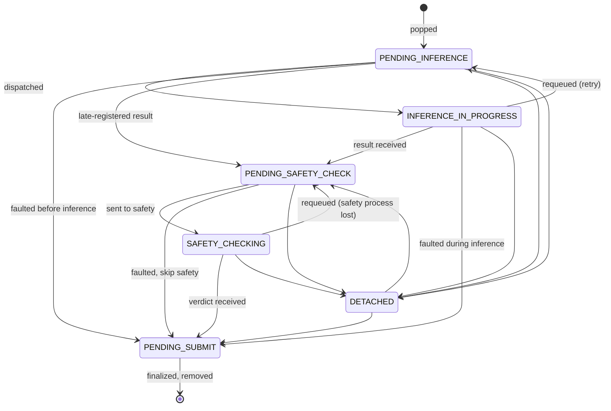

# Job State Machine

- [Job State Machine](#job-state-machine)
    - [Why a state machine?](#why-a-state-machine)
    - [The stages](#the-stages)
    - [The stage dual-presence rule](#the-stage-dual-presence-rule)
    - [Allowed transitions](#allowed-transitions)
    - [The DETACHED stage](#the-detached-stage)
    - [Job faults](#job-faults)
    - [Lookup lifetime](#lookup-lifetime)
    - [Identity stability](#identity-stability)
    - [See also](#see-also)

Where the [job lifecycle](job_lifecycle.md) page traces a job *across* subsystems, this page is about
the one place that records *where a job is*: the
[`JobTracker`][horde_worker_regen.process_management.jobs.job_tracker.JobTracker]. Every **image** job the
worker knows about is exactly one
[`TrackedJob`][horde_worker_regen.process_management.jobs.job_tracker.TrackedJob] in a single
`dict[GenerationID, TrackedJob]`, carrying an explicit
[`JobStage`][horde_worker_regen.process_management.jobs.job_tracker.JobStage]. All stage changes go through
one transition method that validates legality against a fixed table, so "a job is in exactly one stage"
is enforced **structurally, not by convention**. That property is what makes the pipeline debuggable
and is the backstop for the no-loss invariant the rest of the worker relies on. (Alchemy forms are
tracked separately by
[`AlchemyCoordinator`][horde_worker_regen.process_management.jobs.alchemy_popper.AlchemyCoordinator] and
never enter this machine.)

Each `TrackedJob` also records a `stage_timestamps` map: the first time it entered each stage (plus a
terminal `FINALIZED` stamp). On finalize, a registered observer folds those into the worker run
metrics, where they become queue-wait, end-to-end, and safety latencies and the per-job
[duty-cycle phase breakdown](duty-cycle.md#phase-breakdown). See
[Architecture → Metrics and observability](architecture.md#metrics-and-observability).

## Why a state machine?

The previous implementation used separate collections (`jobs_pending_inference`, `jobs_in_progress`,
etc.) and moved jobs between them with ad-hoc mutations spread across multiple components. A job could
silently end up in two collections, or in none, and reconstructing how it got there meant reading
every mutation site. The state machine eliminates that whole class of bug: every transition is
validated against the [allowed-transition table](#allowed-transitions), and the current stage is a
single source of truth. The legacy collection names survive only as read-only **derived views** over
the `TrackedJob` map, so existing call sites keep working without being able to corrupt the state.

## The stages

| Stage                   | Meaning                                                         |
| ----------------------- | --------------------------------------------------------------- |
| `PENDING_INFERENCE`     | Popped, waiting for dispatch to an inference process            |
| `INFERENCE_IN_PROGRESS` | Sent to an inference process, awaiting result                   |
| `DETACHED`              | Tracked but not in any queue; transient hand-off between stages |
| `PENDING_SAFETY_CHECK`  | Inference finished; waiting for a safety process                |
| `SAFETY_CHECKING`       | Sent to safety process, awaiting verdict                        |
| `PENDING_SUBMIT`        | Ready for API submission (success or fault); **terminal**       |

`PENDING_SUBMIT` is the only terminal stage: a job leaves it by being removed from the tracker
(`finalize_submitted`), at which point its `FINALIZED` timestamp is stamped. `FINALIZED` is therefore
*not* a `JobStage`, only a timestamp key. `DETACHED` is the only stage a job must never rest in across
loop iterations (see [The DETACHED stage](#the-detached-stage)).

## The stage dual-presence rule

The one intentional exception to "one stage at a time": a job in `INFERENCE_IN_PROGRESS` is **also**
visible in the `jobs_pending_inference` derived view. This is because queue-size accounting depends on
knowing how many jobs are still "in the pipeline" before submission (the `+ (max_threads - 1)` headroom
in the [pop gauntlet's queue-full
check](performance_and_backpressure.md#queue-sizing-and-the-hold-back-gate) is the consumer). The job
leaves `jobs_pending_inference` only when the inference result (or a fault) arrives. The underlying
`JobStage` is still `INFERENCE_IN_PROGRESS`; the dual visibility is a derived-view concern, not a stage
violation.

## Allowed transitions

These are the only legal moves; any other is rejected by the transition method. The diagram is the
`_ALLOWED_TRANSITIONS` table rendered directly. The happy path runs left to right along the top
(`PENDING_INFERENCE → INFERENCE_IN_PROGRESS → PENDING_SAFETY_CHECK → SAFETY_CHECKING →
PENDING_SUBMIT`); the remaining edges are faults, retries, and `DETACHED` hand-offs.

## The DETACHED stage

`DETACHED` is a transient stage for hand-offs between components. A job must not remain `DETACHED`
across loop iterations. It exists so that `queue_for_safety` and `queue_for_submit` can atomically move
a job out of its current stage without requiring the next component to "know" where it came from. It is
also the only stage excluded from `num_jobs_total`, precisely because a job is only ever passing
through it.

## Job faults

A job can fail at any stage: source-image download failure, inference crash or hang, safety-evaluation
error, or submission timeout. Two distinct things are called "faults" here, and keeping them apart
matters:

- **Fault records** are `GenMetadataEntry` objects (keyed by `GenerationID`, held in the `job_faults`
  collection) that annotate *why* something went wrong, so the worker can report it to the horde. These
  records are kept **independent of job lifetime**: they survive `finalize_submitted` and must be
  explicitly cleared via `clear_faults_for_job`, which prevents a fault recorded just after finalization
  from being lost.
- **A faulted inference attempt** is resolved by the tracker into one of three outcomes
  ([`InferenceFailureResolution`][horde_worker_regen.process_management.jobs.job_tracker.InferenceFailureResolution]):
  `RETRY` or `RETRY_DEGRADED` requeue the job to `PENDING_INFERENCE` for another (for `RETRY_DEGRADED`,
  more conservative and isolated) attempt; `FAULTED` is terminal and moves the job straight to
  `PENDING_SUBMIT`. There is no fault path to `PENDING_SAFETY_CHECK`: a fault either retries or skips
  ahead to submission. Faulted jobs are still submitted, so the horde learns the generation failed.

The bounded-retry, degraded-retry, and crash-loop-quarantine policy behind these outcomes is described
in [Resilience and recovery](resilience_and_recovery.md); this page only defines the stage moves they
make.

## Lookup lifetime

- `jobs_lookup[response] = HordeJobInfo` is set at pop time and removed at `finalize_submitted`.
- `job_pop_timestamps[job_id]` is set at pop time and removed at `finalize_submitted`.
- Stage collections are derived views; adding a job inserts it, removing it from the tracker removes it
  from all views.

## Identity stability

Stage lookups are keyed by the `ImageGenerateJobPopResponse` object value (pydantic `__eq__` /
`__hash__`). **Any code that rebuilds the response object must do so before `record_popped_job`**, or
lookups will fail silently. The `_apply_sdk_workarounds` function in `job_popper.py` is the only place
that rebuilds the response, and it runs before the job is recorded; see [Job lifecycle → Pop](job_lifecycle.md#1-pop-job_popperpy).

## See also

- [Job lifecycle](job_lifecycle.md): how these stages connect to the subsystems that drive the
  transitions
- [Architecture](architecture.md): where
  [`JobTracker`][horde_worker_regen.process_management.jobs.job_tracker.JobTracker] fits in the shared-state
  pattern
- [Performance and backpressure](performance_and_backpressure.md#queue-sizing-and-the-hold-back-gate):
  the queue accounting that depends on the dual-presence rule
- [Resilience and recovery](resilience_and_recovery.md): the retry/degraded/quarantine policy behind
  the fault outcomes
- [Shutdown and faults](shutdown_and_faults.md): fault propagation across stages during drain and abort
- [`JobStage`][horde_worker_regen.process_management.jobs.job_tracker.JobStage],
  [`TrackedJob`][horde_worker_regen.process_management.jobs.job_tracker.TrackedJob], and
  [`InferenceFailureResolution`][horde_worker_regen.process_management.jobs.job_tracker.InferenceFailureResolution]
