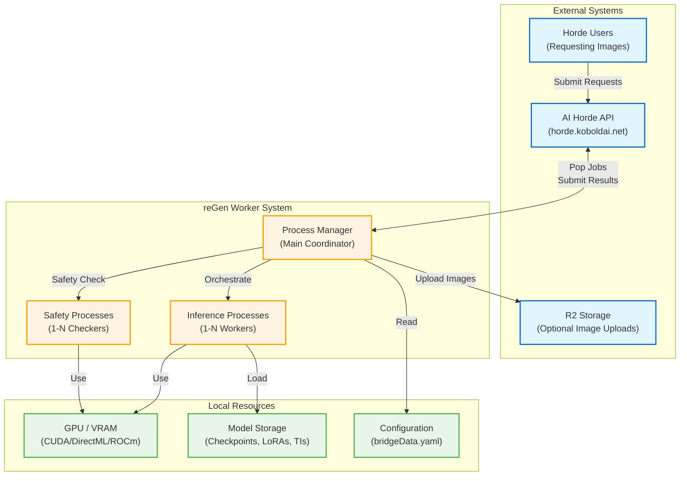

# Level 1: System Overview

This diagram shows the highest-level view of the reGen Worker's place in the AI Horde ecosystem and the main system groups.

## System Groups

### External Systems
- **AI Horde API**: Centralized job distribution service that coordinates work across distributed workers
- **R2 Storage**: Optional cloud storage for generated images (if configured)
- **Horde Users**: End users submitting image generation requests to the Horde

### reGen Worker System
- **Process Manager**: Main coordinator process that orchestrates all worker activities
- **Inference Processes**: GPU worker processes (1-N) that generate images using Stable Diffusion
- **Safety Processes**: Checker processes (1-N) that detect NSFW/CSAM content

### Local Resources
- **GPU / VRAM**: Graphics hardware (supports CUDA, DirectML, ROCm)
- **Model Storage**: Local filesystem storage for AI models (checkpoints, LoRAs, textual inversions)
- **Configuration**: YAML configuration file defining worker capabilities and settings

## Main Hot Path Overview

The core workflow consists of four stages:

1. **Job Acquisition**: Process Manager polls API for available jobs
2. **Image Generation**: Inference processes generate images using GPU
3. **Safety Checking**: Safety processes scan for prohibited content
4. **Job Submission**: Process Manager returns completed images to API

For detailed flows, see:
- [Level 2: Major Subsystems](level-2-major-subsystems.md)
- [Level 3: Hot Path Details](level-3-hot-paths/)
