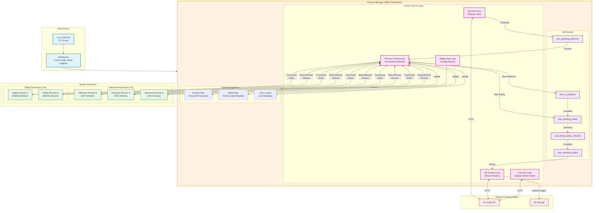

# Level 2: Major Subsystems

This diagram shows the major subsystems within the reGen Worker and their interactions, including the async control loops.

## Subsystem Descriptions

### Entry Points
- **run_worker.py**: CLI entry point that sets up multiprocessing and logging
- **Initialization**: Loads configuration, downloads model references, sets up system

### Process Manager - Async Control Loops

Five async loops run concurrently in the main process:

1. **Job Pop Loop** (`api_job_pop()`)
   - **File**: `process_manager.py:3606`
   - **Frequency**: Continuous (with delays based on queue state)
   - **Purpose**: Poll AI Horde API for new jobs
   - **Actions**: Check capacity, select models, request jobs, enqueue for processing

2. **Job Submit Loop** (`_job_submit_loop()`)
   - **File**: `process_manager.py:4097`
   - **Frequency**: Every 0.1 seconds
   - **Purpose**: Submit completed jobs back to API
   - **Actions**: Upload images to R2, submit results, update kudos

3. **Process Control Loop** (`_process_control_loop()`)
   - **File**: `process_manager.py:4150`
   - **Frequency**: Every 0.2 seconds
   - **Purpose**: Orchestrate all worker processes
   - **Actions**: Handle messages, start inference, start safety checks, manage models

4. **User Info Loop** (`_user_info_loop()`)
   - **File**: `process_manager.py:4047`
   - **Frequency**: Every 30 seconds
   - **Purpose**: Update worker statistics and user info
   - **Actions**: Fetch user data, update worker details on API

5. **Bridge Data Loop** (`_bridge_data_reload_loop()`)
   - **File**: `process_manager.py:4112`
   - **Frequency**: Every 10 seconds
   - **Purpose**: Reload configuration if changed
   - **Actions**: Check for config updates, reload settings dynamically

### Job Queues

Jobs flow through five queues in sequence:

1. **jobs_pending_inference**: Jobs waiting to be assigned to an inference process
2. **jobs_in_progress**: Jobs currently being processed (inference + model loading)
3. **jobs_pending_safety**: Jobs with generated images waiting for safety check
4. **jobs_being_safety_checked**: Jobs currently being scanned for NSFW/CSAM
5. **jobs_pending_submit**: Completed jobs ready to be returned to API

### State Management

- **Process Map**: Tracks state of all child processes (inference + safety)
- **Model Map**: Tracks which models are loaded in which processes
- **Jobs Lookup**: Stores metadata for all active jobs (HordeJobInfo objects)

### Worker Processes

- **Inference Processes**: Generate images using hordelib (wraps ComfyUI)
  - Configurable count (1-N based on GPU count/VRAM)
  - Each process can handle one job at a time
  - Uses semaphores to limit concurrent operations

- **Safety Processes**: Check generated images for prohibited content
  - Configurable count (typically 1-2)
  - Uses horde_safety library (NSFW detection + CSAM scanning)
  - Faster than inference, so fewer processes needed

## Inter-Process Communication

### Commands (Main → Child)
- **Transport**: Pipe (Connection object)
- **Direction**: Process Manager → Worker Process
- **Message Types**: Control messages (start inference, preload model, shutdown)

### Status/Results (Child → Main)
- **Transport**: Queue (ProcessQueue object)
- **Direction**: Worker Process → Process Manager
- **Message Types**: State changes, results, heartbeats, memory reports

## Key Files

- **Entry**: `/horde_worker_regen/run_worker.py`
- **Main Coordinator**: `/horde_worker_regen/process_management/process_manager.py` (4843 lines)
- **Entry Point**: `/horde_worker_regen/process_management/main_entry_point.py`
- **Inference Worker**: `/horde_worker_regen/process_management/inference_process.py`
- **Safety Worker**: `/horde_worker_regen/process_management/safety_process.py`
- **Messages**: `/horde_worker_regen/process_management/messages.py`

## Next Level Details

For detailed flow diagrams of each hot path:
- [Level 3: Job Pop Flow](level-3-hot-paths/job-pop-flow.md)
- [Level 3: Inference Flow](level-3-hot-paths/inference-flow.md)
- [Level 3: Safety Check Flow](level-3-hot-paths/safety-check-flow.md)
- [Level 3: Job Submit Flow](level-3-hot-paths/job-submit-flow.md)
