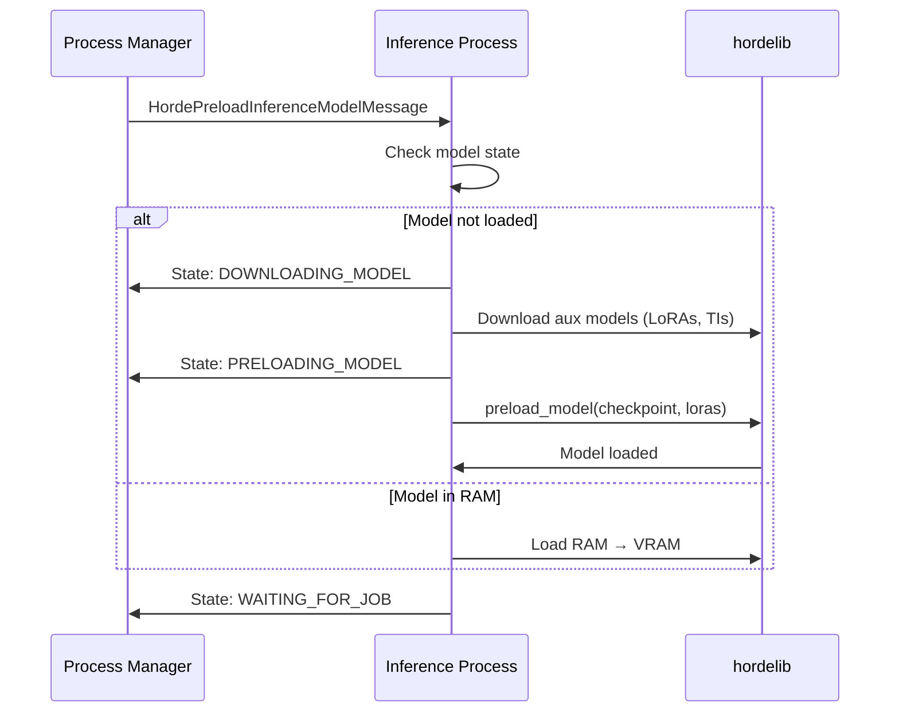

# Level 3: Inference Flow (Image Generation)

This diagram shows the detailed flow of how jobs are processed through the inference pipeline, from model preloading to image generation.

**Primary Files**:
- Process Manager: `process_manager.py:4150-4300` (`_process_control_loop()`)
- Inference Process: `inference_process.py:507-829` (`start_inference()`)

```mermaid
flowchart TD
    Start([Process Control Loop<br/>Every 0.2s]) --> ReceiveMessages[Receive Messages from<br/>All Child Processes]

    ReceiveMessages --> ProcessMessages[Process State Changes<br/>Results, Heartbeats]

    ProcessMessages --> CheckPendingInf{Jobs in<br/>jobs_pending_inference?}

    CheckPendingInf -->|No| CheckOther[Check Safety Queue]
    CheckPendingInf -->|Yes| GetJob[Get Next Job from Queue]

    GetJob --> FindProcess[Find Available Inference Process<br/>get_next_job_and_process]

    FindProcess --> CheckFound{Process<br/>Found?}

    CheckFound -->|No| CheckOther
    CheckFound -->|Yes| CheckModel{Correct Model<br/>Loaded?}

    CheckModel -->|No - Need Preload| StartPreload[Send HordePreloadInferenceModelMessage<br/>to Process]

    StartPreload --> MoveToProgress[Move Job to<br/>jobs_in_progress]

    CheckModel -->|Yes - Ready| StartInference

    MoveToProgress --> WaitPreload[Wait for Process to<br/>Change State]

    subgraph InferenceProcess1["Inference Process - Preload Model"]
        ReceivePreload[Receive Preload Message] --> CheckModelState{Model Already<br/>Loaded?}

        CheckModelState -->|Yes - In VRAM| SendReady1[Send WAITING_FOR_JOB State]
        CheckModelState -->|Yes - In RAM| LoadToVRAM[Load from RAM to VRAM<br/>hordelib.preload_model]

        LoadToVRAM --> SendReady2[Send WAITING_FOR_JOB State]

        CheckModelState -->|No| SetStateDownload[Send DOWNLOADING_MODEL State]

        SetStateDownload --> CheckAux{Has Aux Models?<br/>LoRAs, TIs?}

        CheckAux -->|Yes| DownloadAux[Download Aux Models<br/>horde_model_reference]
        DownloadAux --> SetStatePreload
        CheckAux -->|No| SetStatePreload[Send PRELOADING_MODEL State]

        SetStatePreload --> LoadModel[Load Checkpoint + Aux<br/>hordelib.preload_model]

        LoadModel --> CheckSuccess{Load<br/>Success?}

        CheckSuccess -->|No| SendError[Send ERROR State<br/>with Fault Info]
        CheckSuccess -->|Yes| SendReady3[Send WAITING_FOR_JOB State]
    end

    WaitPreload -.->|State: WAITING_FOR_JOB| StartInference[Send HordeInferenceControlMessage<br/>to Process]

    StartInference --> WaitInference[Wait for Inference<br/>Completion]

    subgraph InferenceProcess2["Inference Process - Generate Image"]
        ReceiveInference[Receive Inference Message] --> AcquireSem[Acquire inference_semaphore<br/>Limit Concurrent Jobs]

        AcquireSem --> SetStateStart[Send INFERENCE_STARTING State]

        SetStateStart --> CallHordelib[hordelib.basic_inference<br/>job_info]

        CallHordelib --> SetupPipeline[Setup ComfyUI Pipeline<br/>Load Nodes, Samplers, etc.]

        SetupPipeline --> RunSampling[Run Sampling Loop<br/>Denoising Steps]

        RunSampling --> Progress[Send Progress Heartbeats<br/>HordeProcessHeartbeatMessage]

        Progress --> CheckSteps{All Steps<br/>Complete?}

        CheckSteps -->|No| RunSampling
        CheckSteps -->|Yes| ReleaseSem[Release inference_semaphore]

        ReleaseSem --> AcquireVAE[Acquire vae_decode_semaphore<br/>Limit VRAM for Decode]

        AcquireVAE --> SetStatePost[Send INFERENCE_POST_PROCESSING State]

        SetStatePost --> VAEDecode[VAE Decode to Images]

        VAEDecode --> CheckPostProcess{Post-Processing<br/>Required?}

        CheckPostProcess -->|Yes| RunPostProcess[Face Fix, Upscale, etc.<br/>hordelib pipeline]
        RunPostProcess --> EncodeImages
        CheckPostProcess -->|No| EncodeImages[Encode Images to Base64]

        EncodeImages --> ReleaseVAE[Release vae_decode_semaphore]

        ReleaseVAE --> SendResult[Send HordeInferenceResultMessage<br/>with Base64 Images + Metadata]

        SendResult --> CheckUnload{Should Unload<br/>from VRAM?}

        CheckUnload -->|Yes - Low Memory Mode| UnloadModel[Unload Model to RAM<br/>hordelib.unload_model]
        UnloadModel --> SetStateWaiting
        CheckUnload -->|No - High Memory Mode| SetStateWaiting[Send WAITING_FOR_JOB State]
    end

    WaitInference -.->|Result Message| ReceiveResult[Receive Inference Result<br/>in Process Manager]

    ReceiveResult --> CheckFaults{Inference<br/>Faulted?}

    CheckFaults -->|Yes| HandleFault[Store Fault Info<br/>Skip Safety Check]
    HandleFault --> EnqueueSubmit
    CheckFaults -->|No| StoreImages[Store Base64 Images<br/>in HordeJobInfo]

    StoreImages --> EnqueueSafety[Move to<br/>jobs_pending_safety_check]

    EnqueueSubmit[Move to<br/>jobs_pending_submit]

    EnqueueSafety --> CheckOther
    EnqueueSubmit --> CheckOther

    CheckOther --> End([Continue Loop])

    classDef decision fill:#fff4e1,stroke:#ff9900,stroke-width:2px
    classDef process fill:#e1f5ff,stroke:#0066cc,stroke-width:2px
    classDef subprocess fill:#e8f5e9,stroke:#4caf50,stroke-width:2px
    classDef message fill:#f3e5f5,stroke:#9c27b0,stroke-width:2px
    classDef error fill:#ffebee,stroke:#f44336,stroke-width:2px

    class CheckPendingInf,CheckFound,CheckModel,CheckSuccess,CheckSteps,CheckPostProcess,CheckUnload,CheckFaults,CheckModelState,CheckAux decision
    class GetJob,FindProcess,ReceiveMessages,ProcessMessages,ReceiveResult,StoreImages,HandleFault process
    class ReceivePreload,LoadToVRAM,DownloadAux,LoadModel,ReceiveInference,SetupPipeline,RunSampling,VAEDecode,RunPostProcess,EncodeImages,UnloadModel subprocess
    class StartPreload,StartInference,MoveToProgress,WaitPreload,WaitInference,SendReady1,SendReady2,SendReady3,SetStateDownload,SetStatePreload,SetStateStart,SetStatePost,Progress,SendResult,SetStateWaiting,EnqueueSafety,EnqueueSubmit message
    class SendError error
```



## Flow Stages

### 1. Process Manager - Job Matching (Lines 4150-4200)

**get_next_job_and_process() Logic**:

```python
Priority Matching:
1. Processes with exact model loaded in VRAM (fastest)
2. Processes with exact model loaded in RAM (fast)
3. Processes with same base model loaded (medium)
4. Any available process (slow - requires model download)
```

**Process States Considered "Available"**:
- `WAITING_FOR_JOB`: Idle, ready for work
- `PROCESS_ENDED`: Process completed previous job (in certain modes)

**Exclusions**:
- Processes in `PRELOADING_MODEL`, `DOWNLOADING_MODEL`
- Processes with pending jobs
- Processes in error states

### 2. Model Preloading (Lines 2527-2700)

**When Preload is Needed**:
- Model not loaded at all (first time)
- Wrong model loaded (different checkpoint)
- Model in RAM but job needs it in VRAM

**Preload Message Flow**:



**File**: `inference_process.py:350-450`

**Timeout**: Configurable `preload_timeout` (default 300s)

### 3. Inference Execution (Lines 507-829)

**Semaphore Control**:

1. **inference_semaphore**: Limits concurrent inference jobs
   - Acquired before sampling starts
   - Released after sampling completes (before VAE decode)
   - Allows overlap of post-processing with new inference

2. **vae_decode_semaphore**: Limits concurrent VAE decodes
   - Acquired before VAE decode
   - Released after post-processing
   - Prevents VRAM exhaustion during decode

**Configuration**:
```yaml
# High Performance Mode
high_performance_mode: true
post_process_job_overlap: true  # Enables semaphore overlap

# Semaphore Values
max_inference_processes: 2
max_concurrent_inference_processes: 2  # inference_semaphore value
```

### 4. Inference Steps (inference_process.py:507-650)

**hordelib.basic_inference() Execution**:

```python
result = hordelib.basic_inference(
    model_name=job.model,
    sampler_name=job.params.sampler_name,
    cfg_scale=job.params.cfg_scale,
    denoising_strength=job.params.denoising_strength,
    seed=job.params.seed,
    height=job.params.height,
    width=job.params.width,
    karras=job.params.karras,
    tiling=job.params.tiling,
    hires_fix=job.params.hires_fix,
    clip_skip=job.params.clip_skip,
    control_type=job.params.control_type,
    image_is_control=job.source_image,
    return_control_map=job.params.return_control_map,
    prompt=job.prompt,
    ddim_steps=job.params.ddim_steps,
    n_iter=job.params.n_iter,
    # ... many more parameters
)
```

**ComfyUI Pipeline**:
1. Load nodes (sampler, VAE, CLIP, etc.)
2. Setup conditioning (prompt encoding)
3. Run sampling loop (denoising)
4. VAE decode latents → pixels
5. Post-processing (upscale, face fix)

**Progress Callbacks**:
- Sent every N steps (configurable)
- Contains current step, total steps
- Used for API heartbeats
- Prevents timeout on long jobs

### 5. Post-Processing (Lines 650-750)

**Optional Operations**:
- **Face Restoration**: CodeFormer, GFPGAN
- **Upscaling**: RealESRGAN, LDSR
- **Strip Background**: Remove background
- **ControlNet Output**: Return control maps

**Post-Processing Modes**:
```python
if high_performance_mode and post_process_job_overlap:
    # Release inference_semaphore before post-processing
    # Allows new job to start inference while current job post-processes
    inference_semaphore.release()
    # Acquire vae_decode_semaphore
    vae_decode_semaphore.acquire()
else:
    # Keep inference_semaphore until fully complete
    # No overlap, simpler but slower
```

### 6. Result Return (Lines 750-829)

**HordeInferenceResultMessage Contents**:
```python
{
    "job_id": str,
    "job_image_results": [
        {
            "image": base64_string,
            "generation_faults": [list of faults],
            "state": "ok" | "faulted"
        },
        # ... for each image in batch
    ],
    "sdk_api_job_info": job_metadata,
    "state": "ok" | "faulted",
    "time_elapsed": float
}
```

**Image Encoding**:
- Images are PNG format
- Base64 encoded for transport
- Typical size: 1-3 MB per image (base64)

### 7. Model Unloading (Lines 800-829)

**Unload Decision Logic**:

```python
if not high_memory_mode:
    # Unload from VRAM to RAM after each job
    hordelib.unload_model()
elif not very_high_memory_mode:
    # Unload after timeout (if no new jobs)
    if time_since_last_job > model_unload_timeout:
        hordelib.unload_model()
else:
    # Never unload (datacenter mode)
    # Keep models in VRAM always
```

**Memory Modes**:
- **Low Memory**: Unload after every job (slow, low VRAM)
- **Medium Memory**: Unload after timeout (balanced)
- **High Memory**: Never unload (fast, high VRAM)
- **Very High Memory**: Multiple models in VRAM (datacenter)

## Performance Characteristics

### Timing Breakdown

**Typical Job (512x512, 30 steps, SD 1.5)**:
- Model preload (first time): 10-30s
- Model preload (RAM → VRAM): 3-10s
- Aux model download (LoRAs): 2-10s
- Sampling: 10-40s (depends on GPU)
- VAE decode: 1-3s
- Post-processing: 2-20s (if enabled)
- **Total**: 15-100s

**High Resolution (1024x1024, 50 steps, SDXL)**:
- Model preload: 30-90s (SDXL is larger)
- Sampling: 30-120s
- VAE decode: 3-8s
- Post-processing: 5-40s
- **Total**: 70-250s

### Concurrency

**Overlapping Operations** (high_performance_mode):
```
Time →
Job 1: [Preload][Inference====][VAE][Post]
Job 2:              [Preload][Inference====][VAE][Post]
Job 3:                           [Preload][Inference====]
```

**Sequential Operations** (normal mode):
```
Time →
Job 1: [Preload][Inference====][VAE][Post]
Job 2:                                      [Preload][Inference====]
```

### Fault Handling

**Common Faults**:
- `"download_failed"`: Model download failed
- `"model_load_failed"`: Model loading failed
- `"csam"`: CSAM detected (from safety check)
- `"nsfw"`: NSFW detected (from safety check)
- `"black_image"`: Generated black/corrupted image
- `"timeout"`: Inference took too long

**Fault Flow**:
1. Inference process detects fault
2. Sends result with `state="faulted"`
3. Process Manager stores fault info
4. Job skips safety check
5. Job goes directly to jobs_pending_submit
6. API receives fault information

## Key Variables

**Process Manager** (`process_manager.py`):
- `jobs_pending_inference`: `List[ImageGenerateJobPopResponse]`
- `jobs_in_progress`: `List[ImageGenerateJobPopResponse]`
- `jobs_pending_safety_check`: `List[HordeJobInfo]`
- `_process_map.inference_processes`: `list[HordeProcessInfo]`
- `_horde_model_map`: `HordeModelMap` (tracks loaded models)

**Inference Process** (`inference_process.py`):
- `_loaded_model_name`: `str | None` (currently loaded model)
- `_loaded_horde_model_name`: `str | None` (Horde model name)
- `inference_semaphore`: `Semaphore` (concurrency control)
- `vae_decode_semaphore`: `Semaphore` (VRAM control)

## Related Flows

**Previous Step**:
- [Job Pop Flow](job-pop-flow.md) → jobs_pending_inference

**Next Step**:
- jobs_pending_safety_check → [Safety Check Flow](safety-check-flow.md)
- jobs_pending_submit → [Job Submit Flow](job-submit-flow.md) (if faulted)

**See Also**:
- [Level 4: hordelib Integration](../level-4-components/hordelib-integration.md)
- [Level 4: Semaphore Management](../level-4-components/semaphore-control.md)
- [Level 4: Model Loading](../level-4-components/model-loading.md)
