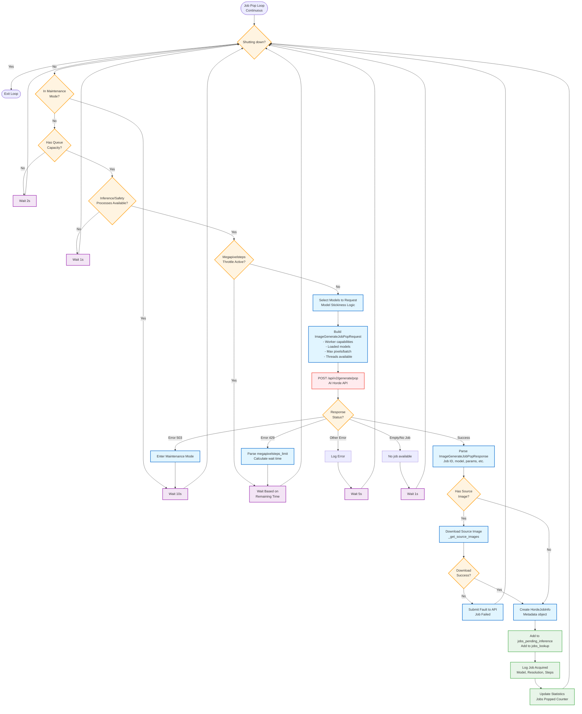
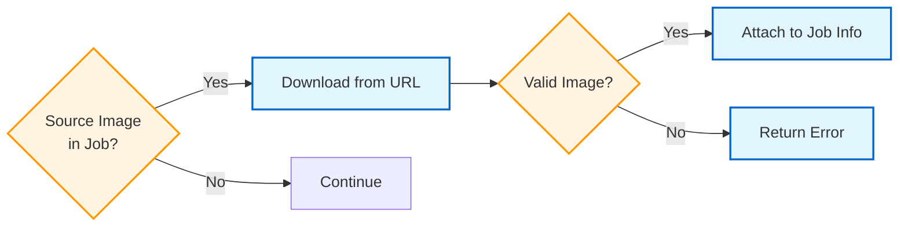

# Level 3: Job Pop Flow (Job Acquisition)

This diagram shows the detailed flow of how the worker acquires jobs from the AI Horde API.

**Primary File**: `process_manager.py:3606-3850` (`api_job_pop()`)



## Flow Stages

### 1. Pre-flight Checks (Lines 3606-3680)

**Checks performed before requesting a job:**

- **Shutdown Check**: Exit loop if worker is shutting down
- **Maintenance Mode**: Wait if API is in maintenance (auto-recovery)
- **Queue Capacity**: Ensure we have room for more jobs
  - Formula: `current_queue_size < (queue_size + max_threads)`
  - Prevents overloading the worker
- **Process Availability**: Ensure at least one inference and safety process is ready
  - Checks: `WAITING_FOR_JOB` or `PROCESS_ENDED` state
- **Throttle Check**: Respect megapixelsteps rate limiting
  - If throttled, calculate wait time and sleep

### 2. Model Selection (Lines 3680-3730)

**Model Stickiness Logic**: Prefer models already loaded to reduce load times

```
Priority Order:
1. Models loaded in VRAM (fastest)
2. Models loaded in RAM (fast)
3. Models with matching base name (medium)
4. All configured models (slow - requires download/load)
```

**Special Handling**:
- Alchemy models (upscaling/post-processing)
- SDXL vs SD 1.5 separation
- Model form support (stable diffusion, flux, etc.)

### 3. Request Building (Lines 3730-3780)

**ImageGenerateJobPopRequest Construction**:

```python
{
    "apikey": worker_api_key,
    "name": worker_name,
    "models": selected_models,  # From model stickiness
    "max_pixels": configured_max_pixels,
    "threads": available_threads,  # Based on free processes
    "allow_img2img": true/false,
    "allow_painting": true/false,
    "allow_post_processing": true/false,
    "allow_controlnet": true/false,
    "max_batch": configured_max_batch,
    # ... more capabilities
}
```

**Key Optimization**: Include loaded models in request to get prioritized jobs

### 4. API Call (Lines 3780-3800)

**HTTP Request**:
- **Method**: POST
- **Endpoint**: `/api/v2/generate/pop`
- **Timeout**: Configurable (default 30s)
- **Transport**: aiohttp async HTTP

**Response Handling**:
- **200 OK + Job**: Proceed to parse job
- **200 OK + Empty**: No job available, wait 1s
- **429 Too Many Requests**: Parse throttle info, wait
- **503 Service Unavailable**: Enter maintenance mode
- **Other Errors**: Log and retry

### 5. Error Handling (Lines 3800-3850)

**Megapixelsteps Throttling**:
```python
if status == 429:
    # Parse response
    megapixelsteps_limit = response["megapixelsteps_limit"]
    wait_time = calculate_wait_time(limit)
    # Wait before next request
```

**Maintenance Mode**:
- Triggered by 503 response
- Worker pauses job acquisition
- Continues submitting completed jobs
- Auto-recovery when API is back
- Displays status message to user

**Fault Submission**:
- If source image download fails
- If job is malformed
- Immediately submit fault to API
- Job is NOT processed

### 6. Source Image Handling (Lines 3680-3730)

**_get_source_images() Flow**:



**Image Types**:
- **img2img**: Source image to transform
- **inpainting**: Image with mask
- **ControlNet**: Conditioning image

### 7. Job Enqueue (Lines 3840-3850)

**Final Steps**:
1. Create `HordeJobInfo` object with metadata
2. Add to `jobs_pending_inference` list
3. Add to `jobs_lookup` dict (keyed by job ID)
4. Log job details (model, resolution, steps)
5. Update statistics counters

## Performance Characteristics

### Timing
- **Typical API call**: 0.5-2 seconds
- **With source image download**: +1-3 seconds
- **Throttled wait**: 1-60 seconds (based on megapixelsteps)
- **No job wait**: 1 second
- **Maintenance wait**: 10 seconds

### Concurrency
- Loop runs continuously in async context
- Only one API call at a time (no parallel pops)
- Downloads can timeout after configured duration

### Optimization Features
1. **Model Stickiness**: Prioritizes jobs for loaded models
2. **Capacity Checking**: Prevents queue overload
3. **Throttle Respect**: Avoids API rate limiting
4. **Early Validation**: Checks processes before API call

## Key Variables

**File**: `process_manager.py`

- `jobs_pending_inference`: `List[ImageGenerateJobPopResponse]`
- `jobs_lookup`: `dict[str, HordeJobInfo]` (job_id → metadata)
- `_process_map`: `ProcessMap` (tracks all processes)
- `_horde_model_map`: `HordeModelMap` (tracks loaded models)
- `_api_call_loop_interval`: `float` (delay between requests)

## Related Flows

**Next Steps**:
- Jobs in `jobs_pending_inference` → [Inference Flow](inference-flow.md)

**See Also**:
- [Level 4: Model Stickiness Logic](../level-4-components/model-selection.md)
- [Level 4: Throttle Management](../level-4-components/throttle-handling.md)
