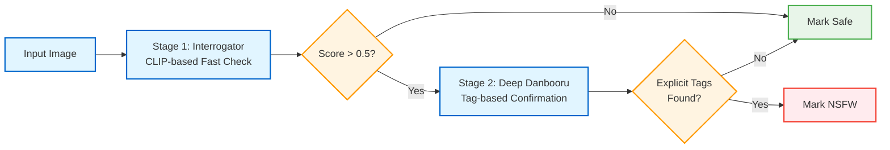

# Level 3: Safety Check Flow (NSFW/CSAM Detection)

This diagram shows the detailed flow of how generated images are checked for NSFW and CSAM content before submission.

**Primary Files**:
- Process Manager: `process_manager.py:2800-2950` (`start_evaluate_safety()`)
- Safety Process: `safety_process.py:171-250` (`evaluate_safety()`)

```mermaid
flowchart TD
    Start([Process Control Loop]) --> CheckQueue{Jobs in<br/>jobs_pending_safety_check?}

    CheckQueue -->|No| End([Continue Loop])
    CheckQueue -->|Yes| GetJob[Get Next Job<br/>from Queue]

    GetJob --> FindProcess[Find Available<br/>Safety Process]

    FindProcess --> CheckFound{Process<br/>Available?}

    CheckFound -->|No| End
    CheckFound -->|Yes| GetImages[Get Base64 Images<br/>from HordeJobInfo]

    GetImages --> BuildMessage[Build HordeSafetyControlMessage<br/>- Job ID<br/>- Images (base64)<br/>- Prompt<br/>- Model info<br/>- Censor flags]

    BuildMessage --> SendMessage[Send Message to<br/>Safety Process]

    SendMessage --> MoveQueue[Move Job to<br/>jobs_being_safety_checked]

    MoveQueue --> WaitResult[Wait for Safety Result]

    subgraph SafetyProcess["Safety Process - Evaluate Safety"]
        ReceiveMsg[Receive Safety Control Message] --> SetState[Send EVALUATING_SAFETY State]

        SetState --> DecodeImages[Decode Base64 Images<br/>to PIL Images]

        DecodeImages --> InitCheckers{Safety Models<br/>Loaded?}

        InitCheckers -->|No - First Run| LoadModels[Load Safety Models<br/>horde_safety library]
        LoadModels --> CheckersReady
        InitCheckers -->|Yes| CheckersReady[Models Ready]

        CheckersReady --> LoopImages[For Each Image<br/>in Batch]

        LoopImages --> CheckNSFW{NSFW Check<br/>Enabled?}

        CheckNSFW -->|Yes| RunInterrogator[Run Interrogator<br/>CLIP-based NSFW Detection]

        RunInterrogator --> GetNSFWScore[Get NSFW Probability<br/>0.0 - 1.0]

        GetNSFWScore --> CheckNSFWThreshold{NSFW Score ><br/>Threshold?}

        CheckNSFWThreshold -->|Yes - NSFW Detected| RunDeepDanbooru[Run Deep Danbooru<br/>Tag Detection]
        CheckNSFWThreshold -->|No - Safe| CheckCSAM

        RunDeepDanbooru --> AnalyzeTags[Analyze Tags for<br/>Explicit Content]

        AnalyzeTags --> ConfirmNSFW{Confirmed<br/>NSFW?}

        ConfirmNSFW -->|Yes| MarkNSFW[Mark Image as NSFW<br/>Add 'nsfw' to Faults]
        ConfirmNSFW -->|No - False Positive| CheckCSAM

        CheckNSFW -->|No| CheckCSAM

        MarkNSFW --> CheckCensor{Censor NSFW<br/>Enabled?}

        CheckCensor -->|Yes| ApplyBlur[Apply Gaussian Blur<br/>to Image]
        ApplyBlur --> CheckCSAM
        CheckCensor -->|No| CheckCSAM

        CheckCSAM{CSAM Check<br/>Enabled?}

        CheckCSAM -->|Yes| RunCSAMDetector[Run CSAM Detector<br/>horde_safety.check_for_csam]

        RunCSAMDetector --> GetCSAMScore[Get CSAM Probability<br/>0.0 - 1.0]

        GetCSAMScore --> CheckCSAMThreshold{CSAM Score ><br/>Threshold?}

        CheckCSAMThreshold -->|Yes - CSAM Detected| MarkCSAM[Mark Image as CSAM<br/>Add 'csam' to Faults<br/>Replace with Black Image]
        CheckCSAMThreshold -->|No - Safe| NextImage

        MarkCSAM --> NextImage

        CheckCSAM -->|No| NextImage

        NextImage{More Images<br/>in Batch?}

        NextImage -->|Yes| LoopImages
        NextImage -->|No| EncodeResults[Encode Images Back<br/>to Base64]

        EncodeResults --> BuildResult[Build HordeSafetyResultMessage<br/>- Job ID<br/>- Censored images<br/>- Faults list<br/>- NSFW flags]

        BuildResult --> SendResult[Send Result to<br/>Process Manager]

        SendResult --> ResetState[Send WAITING_FOR_JOB State]
    end

    WaitResult -.->|Result Received| ProcessResult[Receive Safety Result<br/>in Process Manager]

    ProcessResult --> CheckFaults{Safety Faults<br/>Detected?}

    CheckFaults -->|Yes - NSFW/CSAM| UpdateImages[Replace Images with<br/>Censored Versions]

    UpdateImages --> UpdateFaults[Add Faults to<br/>HordeJobInfo]

    UpdateFaults --> EnqueueSubmit

    CheckFaults -->|No - All Safe| EnqueueSubmit[Move to<br/>jobs_pending_submit]

    EnqueueSubmit --> RemoveFromChecking[Remove from<br/>jobs_being_safety_checked]

    RemoveFromChecking --> End

    classDef decision fill:#fff4e1,stroke:#ff9900,stroke-width:2px
    classDef process fill:#e1f5ff,stroke:#0066cc,stroke-width:2px
    classDef subprocess fill:#e8f5e9,stroke:#4caf50,stroke-width:2px
    classDef message fill:#f3e5f5,stroke:#9c27b0,stroke-width:2px
    classDef warning fill:#ffebee,stroke:#f44336,stroke-width:2px

    class CheckQueue,CheckFound,InitCheckers,CheckNSFW,CheckNSFWThreshold,ConfirmNSFW,CheckCensor,CheckCSAM,CheckCSAMThreshold,NextImage,CheckFaults decision
    class GetJob,FindProcess,GetImages,ProcessResult,RemoveFromChecking process
    class DecodeImages,LoadModels,CheckersReady,RunInterrogator,GetNSFWScore,RunDeepDanbooru,AnalyzeTags,RunCSAMDetector,GetCSAMScore,EncodeResults subprocess
    class BuildMessage,SendMessage,MoveQueue,WaitResult,ReceiveMsg,SetState,BuildResult,SendResult,ResetState,EnqueueSubmit message
    class MarkNSFW,ApplyBlur,MarkCSAM,UpdateImages,UpdateFaults warning
```

## Flow Stages

### 1. Process Manager - Safety Initiation (Lines 2800-2850)

**start_evaluate_safety() Function**:

```python
def start_evaluate_safety(job_info: HordeJobInfo):
    # Find available safety process
    safety_process = find_available_safety_process()

    # Build safety control message
    message = HordeSafetyControlMessage(
        job_id=job_info.job_id,
        job_image_results=job_info.job_image_results,  # Base64 images
        prompt=job_info.prompt,
        model_name=job_info.model,
        censor_nsfw=job_info.censor_nsfw,
        sfw_worker=bridge_data.sfw_worker,
    )

    # Send to safety process
    safety_process.pipe_connection.send(message)

    # Update queues
    jobs_being_safety_checked.append(job_info)
```

**File**: `process_manager.py:2800-2850`

### 2. Safety Process - Model Loading (Lines 100-170)

**horde_safety Library Integration**:

```python
from horde_safety.deep_danbooru_model import get_deep_danbooru_model
from horde_safety.interrogate import get_interrogator_model

# Lazy load on first use
interrogator = get_interrogator_model()
deep_danbooru = get_deep_danbooru_model()
csam_checker = get_csam_model()
```

**Models**:
1. **Interrogator**: CLIP-based NSFW classifier
   - Fast, runs on all images
   - Returns probability score
   - Detects: nudity, explicit content

2. **Deep Danbooru**: Tag-based classifier
   - Slower, runs only if interrogator flags NSFW
   - Returns tags (e.g., "nude", "explicit", "underwear")
   - Confirms/refines NSFW detection

3. **CSAM Detector**: Specialized CSAM classifier
   - Runs on all images (if enabled)
   - High sensitivity
   - Returns probability score

**Model Loading Time**:
- First run: 5-15s (download + load)
- Subsequent runs: 0s (models stay loaded)

### 3. NSFW Detection Pipeline (Lines 171-220)

**Two-Stage NSFW Detection**:



**Stage 1 - Interrogator**:
```python
nsfw_score = interrogator.check_nsfw(image)
# Returns float 0.0 - 1.0
# Threshold: 0.5 (configurable)
```

**Stage 2 - Deep Danbooru** (only if Stage 1 flags):
```python
tags = deep_danbooru.get_tags(image)
# Returns dict: {"tag_name": probability, ...}

explicit_tags = [
    "nude", "nsfw", "explicit", "sex",
    "genitals", "nipples", "underwear"
]

is_nsfw = any(tag in tags and tags[tag] > 0.5
              for tag in explicit_tags)
```

**False Positive Reduction**:
- Stage 1 may flag artistic nudity, swimwear, etc.
- Stage 2 confirms with tag analysis
- Reduces false positives by ~70%

### 4. CSAM Detection (Lines 220-240)

**CSAM Checker**:
```python
csam_score = csam_checker.check_for_csam(image)
# Returns float 0.0 - 1.0
# Threshold: 0.1 (very sensitive)

if csam_score > 0.1:
    # Replace image with black image
    image = create_black_image(width, height)
    faults.append("csam")
```

**High Sensitivity**:
- Lower threshold than NSFW (0.1 vs 0.5)
- Zero tolerance policy
- Automatically replaces image

### 5. Image Censoring (Lines 180-200)

**NSFW Censoring**:
```python
if "nsfw" in faults and censor_nsfw:
    # Apply Gaussian blur
    image = image.filter(ImageFilter.GaussianBlur(radius=30))
```

**CSAM Handling**:
```python
if "csam" in faults:
    # Replace with black image (not blurred)
    image = Image.new('RGB', (width, height), color='black')
```

**Censoring Options**:
- **sfw_worker=true**: Always censor NSFW
- **censor_nsfw=true** (per job): Censor this specific job
- **censor_nsfw=false**: Return NSFW uncensored (if allowed)

### 6. Result Return (Lines 240-250)

**HordeSafetyResultMessage**:
```python
{
    "job_id": str,
    "job_image_results": [
        {
            "image": base64_string,  # Possibly censored
            "generation_faults": ["nsfw", "csam"],
            "nsfw": true/false,
            "censored": true/false
        }
    ],
    "safety_evaluations": [
        {
            "nsfw": true/false,
            "nsfw_score": 0.0-1.0,
            "csam": true/false,
            "csam_score": 0.0-1.0
        }
    ]
}
```

### 7. Process Manager - Result Handling (Lines 2850-2950)

**Receive Safety Result**:
```python
def handle_safety_result(result: HordeSafetyResultMessage):
    job_info = jobs_lookup[result.job_id]

    # Update images (may be censored)
    job_info.job_image_results = result.job_image_results

    # Merge faults
    for img_result, safety_eval in zip(
        result.job_image_results,
        result.safety_evaluations
    ):
        if safety_eval.nsfw:
            img_result.generation_faults.append("nsfw")
        if safety_eval.csam:
            img_result.generation_faults.append("csam")

    # Move to submit queue
    jobs_pending_submit.append(job_info)
    jobs_being_safety_checked.remove(job_info)
```

## Performance Characteristics

### Timing

**Per Image**:
- Interrogator (Stage 1): 0.1-0.5s
- Deep Danbooru (Stage 2): 0.5-2s (only if Stage 1 flags)
- CSAM Detector: 0.2-1s

**Typical Job**:
- Single image (safe): 0.3-1.5s
- Single image (NSFW): 0.8-3.5s (includes Stage 2)
- Batch of 4 images: 1-6s

**Total Safety Check**:
- Fast path (all safe): 0.5-2s
- Slow path (NSFW detected): 2-8s

### Concurrency

**Safety Processes**:
- Typically 1-2 processes configured
- Can run in parallel with inference
- Much faster than inference (1-10x)

**Throughput**:
- Single safety process can handle 10-60 images/min
- Rarely a bottleneck (inference is slower)

### GPU Usage

**Models on GPU**:
- Interrogator: Small CLIP model (~300MB VRAM)
- Deep Danbooru: Small CNN (~200MB VRAM)
- CSAM Detector: Small classifier (~400MB VRAM)
- **Total**: ~1GB VRAM for all models

**Sharing with Inference**:
- Safety processes can share GPU with inference
- Low VRAM overhead
- Can run on CPU if needed (slower)

## Configuration Options

**bridgeData.yaml**:
```yaml
# Safety settings
sfw_worker: false              # If true, always censor NSFW
nsfw_threshold: 0.5            # Interrogator threshold
csam_threshold: 0.1            # CSAM detector threshold
safety_on_gpu: true            # Run safety models on GPU
allow_unsafe_ip: false         # Allow NSFW from untrusted IPs

# Process settings
max_safety_processes: 2        # Number of safety processes
safety_process_timeout: 30     # Timeout for safety check
```

**Per-Job Settings** (from API):
```python
job.censor_nsfw: bool          # Censor NSFW for this job
job.shared: bool               # Image will be shared publicly
job.trusted: bool              # User is trusted
```

## Fault Types

**NSFW Faults**:
- `"nsfw"`: Generic NSFW content detected
- Censored with blur if `censor_nsfw=true`
- Not censored if `censor_nsfw=false` and allowed

**CSAM Faults**:
- `"csam"`: CSAM content detected
- Always replaced with black image
- Zero tolerance, no exceptions

**Safety Fault Handling**:
- Faults are added to job metadata
- Sent to API with submission
- API tracks fault rates per worker
- High fault rates can trigger investigation

## Key Variables

**Process Manager** (`process_manager.py`):
- `jobs_pending_safety_check`: `List[HordeJobInfo]`
- `jobs_being_safety_checked`: `List[HordeJobInfo]`
- `jobs_pending_submit`: `List[HordeJobInfo]`
- `_process_map.safety_processes`: `list[HordeProcessInfo]`

**Safety Process** (`safety_process.py`):
- `_interrogator_model`: Interrogator instance (lazy loaded)
- `_deep_danbooru_model`: Deep Danbooru instance (lazy loaded)
- `_csam_model`: CSAM detector instance (lazy loaded)

## Related Flows

**Previous Step**:
- [Inference Flow](inference-flow.md) → jobs_pending_safety_check

**Next Step**:
- jobs_pending_submit → [Job Submit Flow](job-submit-flow.md)

**See Also**:
- [Level 4: horde_safety Integration](../level-4-components/safety-models.md)
- [Level 4: Censoring Logic](../level-4-components/image-censoring.md)
