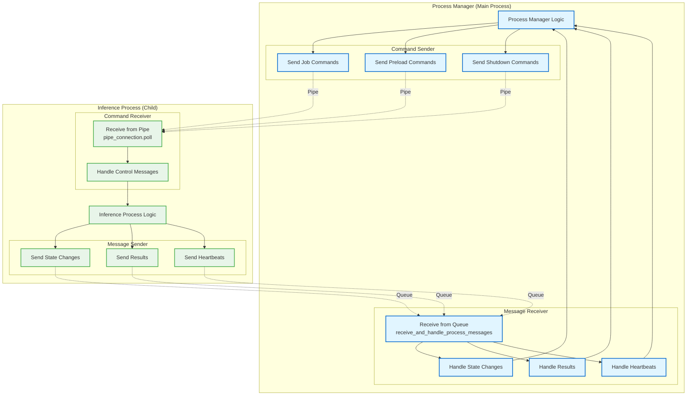
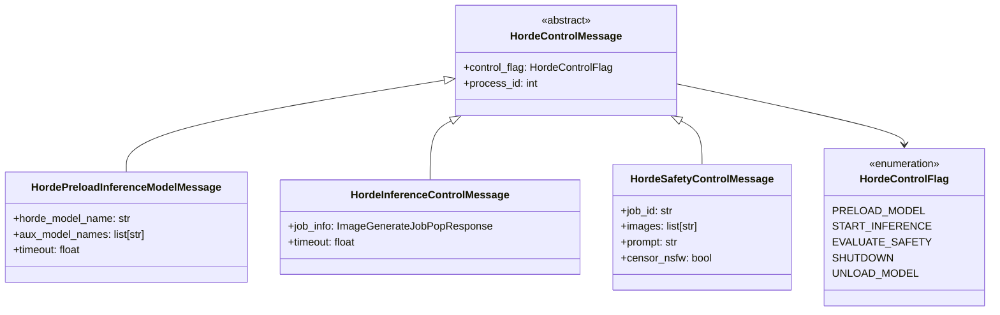
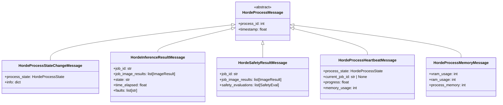
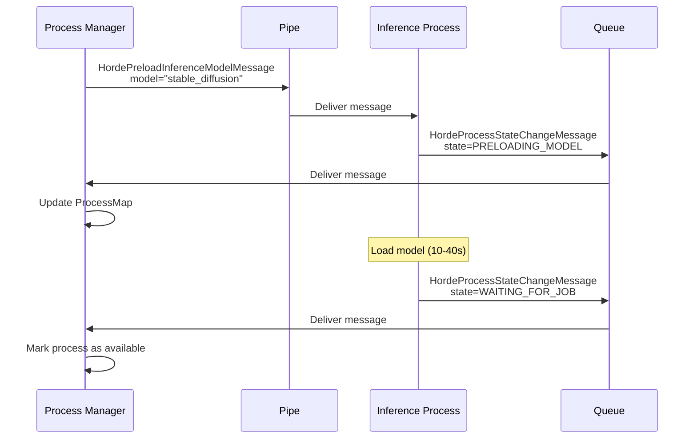
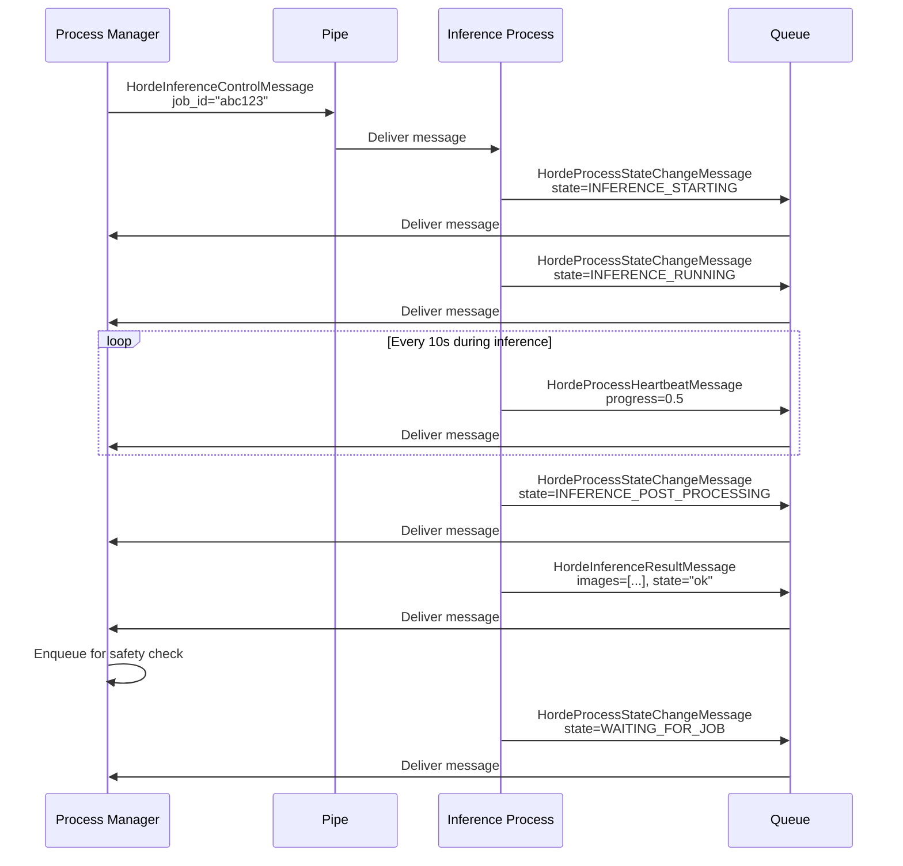
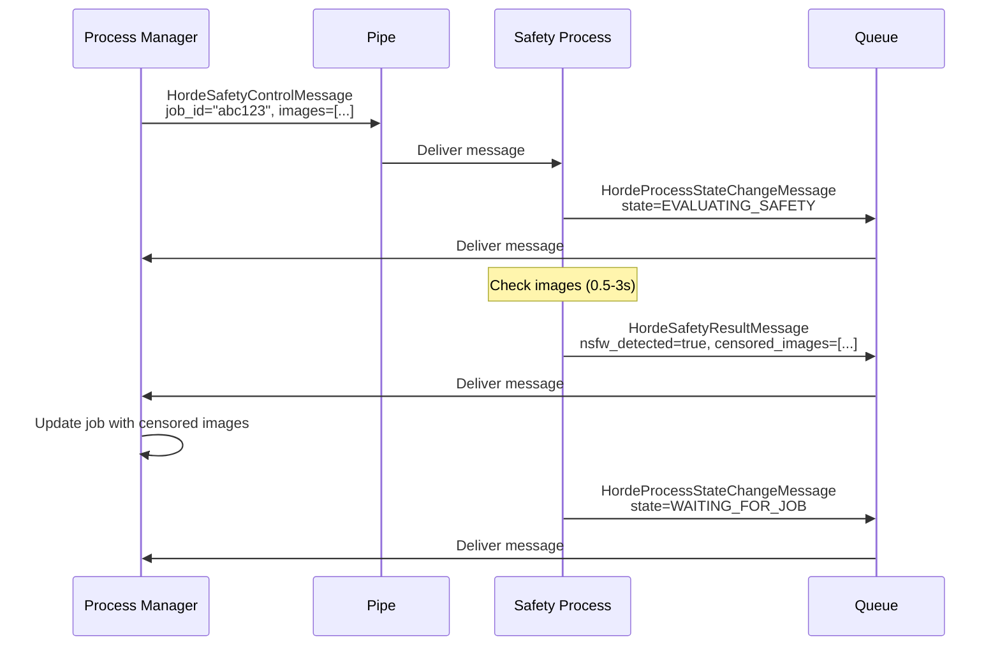

# Level 4: Inter-Process Communication (IPC)

This diagram shows the detailed component-level view of how the Process Manager communicates with child processes using pipes and queues.

**Primary Files**:
- Message Definitions: `messages.py`
- Base Process: `horde_process.py`
- Process Manager: `process_manager.py`

## IPC Architecture



## Communication Channels

### 1. Pipe (Manager → Child)

**Purpose**: Send commands from manager to child process

**Type**: `multiprocessing.Connection` (duplex pipe)

**Direction**: Unidirectional in practice (manager → child only)

**Transport**: Pickle-serialized Python objects

**Creation**:
```python
# In Process Manager
parent_conn, child_conn = multiprocessing.Pipe(duplex=True)

# Spawn process with child_conn
process = multiprocessing.Process(
    target=start_inference_process,
    args=(child_conn, process_queue, ...)
)

# Manager keeps parent_conn
process_info.pipe_connection = parent_conn
```

**Usage**:
```python
# Send command to child
message = HordeInferenceControlMessage(job_info=...)
pipe_connection.send(message)  # Non-blocking
```

### 2. Queue (Child → Manager)

**Purpose**: Send messages from child to manager

**Type**: `multiprocessing.Queue` (wrapped in `ProcessQueue`)

**Direction**: Unidirectional (child → manager only)

**Transport**: Pickle-serialized Python objects

**Creation**:
```python
# In Process Manager
process_queue = multiprocessing.Queue()

# Spawn process with queue
process = multiprocessing.Process(
    target=start_inference_process,
    args=(pipe_connection, process_queue, ...)
)

# Manager receives from queue
process_info.process_queue = process_queue
```

**Usage**:
```python
# Child sends message
message = HordeProcessStateChangeMessage(...)
process_queue.put(message)  # Non-blocking

# Manager receives messages
while not queue.empty():
    message = queue.get_nowait()
    handle_message(message)
```

## Message Types

### Manager → Child (via Pipe)



**Message Descriptions**:

1. **HordePreloadInferenceModelMessage**:
   - **Purpose**: Tell process to preload a model into memory
   - **Fields**: Model name, aux models (LoRAs, TIs), timeout
   - **Response**: State change to PRELOADING_MODEL, then WAITING_FOR_JOB

2. **HordeInferenceControlMessage**:
   - **Purpose**: Tell process to start inference on a job
   - **Fields**: Complete job info (params, prompt, etc.), timeout
   - **Response**: State changes (INFERENCE_STARTING → RUNNING → COMPLETE), then result message

3. **HordeSafetyControlMessage**:
   - **Purpose**: Tell process to check images for NSFW/CSAM
   - **Fields**: Job ID, images (base64), prompt, censor flag
   - **Response**: State change to EVALUATING_SAFETY, then result message

### Child → Manager (via Queue)



**Message Descriptions**:

1. **HordeProcessStateChangeMessage**:
   - **Purpose**: Notify manager of process state change
   - **Fields**: New state, optional info dict
   - **Frequency**: On every state transition
   - **Example**: WAITING_FOR_JOB → INFERENCE_STARTING

2. **HordeInferenceResultMessage**:
   - **Purpose**: Send inference results back to manager
   - **Fields**: Job ID, images (base64), state, faults, timing
   - **Frequency**: Once per job completion
   - **Size**: 1-10 MB (with base64 images)

3. **HordeSafetyResultMessage**:
   - **Purpose**: Send safety check results back to manager
   - **Fields**: Job ID, censored images, safety evaluations
   - **Frequency**: Once per safety check
   - **Size**: 1-10 MB (with censored images if needed)

4. **HordeProcessHeartbeatMessage**:
   - **Purpose**: Prove process is alive and provide progress
   - **Fields**: State, job ID, progress (0-1), memory usage
   - **Frequency**: Every 10-60s
   - **Size**: <1 KB

5. **HordeProcessMemoryMessage**:
   - **Purpose**: Report memory usage
   - **Fields**: VRAM, RAM, process memory
   - **Frequency**: Every 60s
   - **Size**: <1 KB

## Message Flow Examples

### Example 1: Preload Model



### Example 2: Run Inference



### Example 3: Safety Check



## Message Receiving Loop

**Process Manager Side** (`process_manager.py:1800-1900`):

```python
def receive_and_handle_process_messages(self):
    """Receive and process all pending messages from child processes"""

    for process_info in self.all_processes.values():
        queue = process_info.process_queue

        # Receive all pending messages (non-blocking)
        while not queue.empty():
            try:
                message = queue.get_nowait()
                self._handle_process_message(message, process_info)
            except queue.Empty:
                break

def _handle_process_message(self, message, process_info):
    """Handle a single message from a child process"""

    if isinstance(message, HordeProcessStateChangeMessage):
        self._handle_state_change(message, process_info)

    elif isinstance(message, HordeInferenceResultMessage):
        self._handle_inference_result(message, process_info)

    elif isinstance(message, HordeSafetyResultMessage):
        self._handle_safety_result(message, process_info)

    elif isinstance(message, HordeProcessHeartbeatMessage):
        self._handle_heartbeat(message, process_info)

    elif isinstance(message, HordeProcessMemoryMessage):
        self._handle_memory_report(message, process_info)

    else:
        logger.warning(f"Unknown message type: {type(message)}")
```

**Child Process Side** (`horde_process.py:200-250`):

```python
def check_for_control_messages(self):
    """Check pipe for control messages from manager"""

    # Non-blocking check
    if self.pipe_connection.poll(timeout=0):
        message = self.pipe_connection.recv()
        self._handle_control_message(message)

def _handle_control_message(self, message):
    """Handle a control message from manager"""

    if isinstance(message, HordePreloadInferenceModelMessage):
        self._preload_model(message)

    elif isinstance(message, HordeInferenceControlMessage):
        self.start_inference(message.job_info)

    elif isinstance(message, HordeSafetyControlMessage):
        self.evaluate_safety(message)

    elif message.control_flag == HordeControlFlag.SHUTDOWN:
        self._shutdown()

    else:
        logger.warning(f"Unknown control message: {message}")
```

## Message Serialization

**Pickle Protocol**:
- Both Pipe and Queue use Python's `pickle` for serialization
- Supports complex objects (dataclasses, enums, etc.)
- Automatic serialization/deserialization

**Size Limits**:
- Pipe: No practical limit (but blocks on large sends)
- Queue: No hard limit (memory permitting)

**Large Messages**:
- Inference results with base64 images: 1-10 MB
- Safety results with censored images: 1-10 MB
- Other messages: <10 KB

**Performance**:
- Pickle serialization: ~1-5 ms for small messages
- Pickle serialization: ~50-200 ms for large messages (MB range)
- Negligible compared to inference time (seconds to minutes)

## Error Handling

**Pipe Errors**:
```python
try:
    pipe_connection.send(message)
except BrokenPipeError:
    # Child process has died
    logger.error(f"Process {process_id} pipe broken")
    replace_process(process_info)
except Exception as e:
    logger.error(f"Error sending to process {process_id}: {e}")
```

**Queue Errors**:
```python
try:
    message = queue.get_nowait()
except queue.Empty:
    # No messages available (expected)
    pass
except Exception as e:
    logger.error(f"Error receiving from process {process_id}: {e}")
```

**Timeout Handling**:
- No explicit timeouts on send/receive
- Timeouts managed at higher level (state machine)
- Hung process detection via heartbeat mechanism

## Performance Characteristics

**Message Latency**:
- Small messages (<10 KB): <1 ms
- Large messages (1-10 MB): 10-100 ms

**Throughput**:
- Queue can handle 1000s of messages/second
- Pipe can handle 100s of messages/second
- Actual rate much lower (bounded by job processing)

**Memory Usage**:
- Queue grows if not drained promptly
- Manager drains queue every 0.2s (sufficient)
- Typical queue depth: 0-10 messages

## Configuration

**IPC Settings** (hardcoded in code):
```python
# Message receive interval
PROCESS_CONTROL_LOOP_INTERVAL = 0.2  # seconds

# Heartbeat intervals
HEARTBEAT_INTERVAL_INFERENCE = 10     # seconds (during inference)
HEARTBEAT_INTERVAL_IDLE = 60          # seconds (while idle)

# Heartbeat timeout
HEARTBEAT_TIMEOUT = 300               # seconds (5 minutes)
```

## Key Files

**Message Definitions**:
- `messages.py`: All message types and enums

**Process Management**:
- `horde_process.py`: Base class with IPC logic
- `inference_process.py`: Inference-specific message handling
- `safety_process.py`: Safety-specific message handling
- `process_manager.py`: Manager-side message handling

**Worker Entry Points**:
- `worker_entry_points.py`: Process spawn functions with IPC setup

## Related Diagrams

**Used In**:
- [Level 3: Inference Flow](../level-3-hot-paths/inference-flow.md)
- [Level 3: Safety Check Flow](../level-3-hot-paths/safety-check-flow.md)

**See Also**:
- [Level 4: Process State Machine](process-state-machine.md)
- [Level 4: Model Management](model-management.md)
