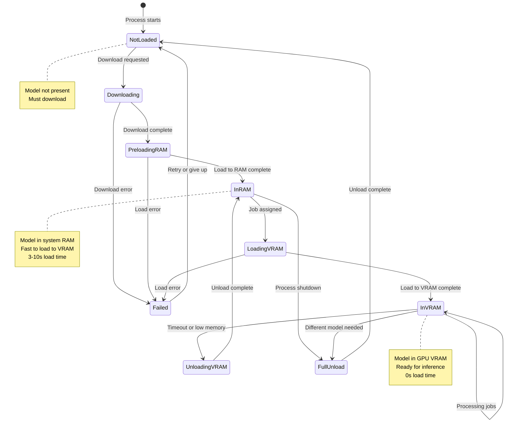
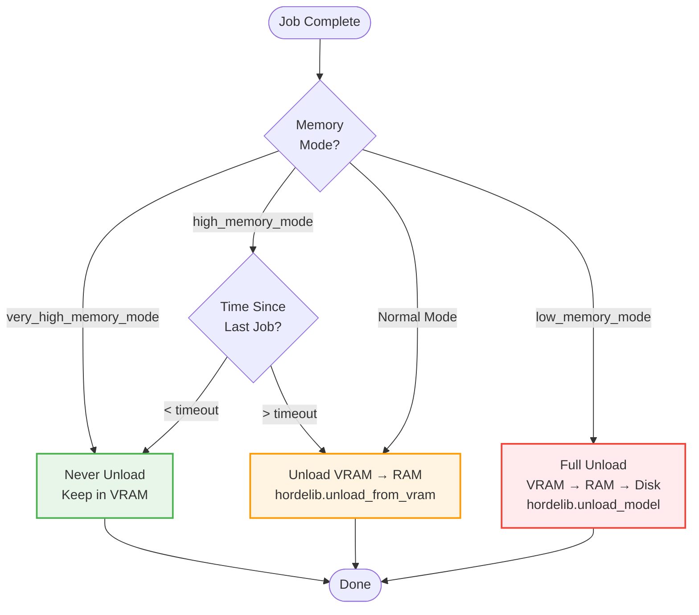

# Level 4: Model Management

This diagram shows the detailed component-level view of how models are managed, including loading, preloading, unloading, and the model stickiness optimization.

**Primary Files**:
- Model Map: `process_manager.py` (`HordeModelMap` class)
- Model Loading: `inference_process.py:350-450` (`_preload_model()`)
- Model Stickiness: `process_manager.py:3680-3730` (in `api_job_pop()`)

## Model State Lifecycle



## Model Map Data Structure

**HordeModelMap Class**:

```python
class HordeModelMap:
    """Tracks which models are loaded in which processes"""

    def __init__(self):
        # Process ID → Loaded model info
        self._loaded_models: dict[int, LoadedModelInfo] = {}

    def get_model_name_in_process(self, process_id: int) -> str | None:
        """Get the name of the model loaded in a process"""

    def get_model_state_in_process(self, process_id: int) -> HordeModelState:
        """Get the state of the model in a process"""

    def get_processes_with_model(self, model_name: str) -> list[int]:
        """Get all processes that have this model loaded"""

    def get_processes_with_model_in_vram(self, model_name: str) -> list[int]:
        """Get processes with model in VRAM (fastest)"""

    def get_processes_with_model_in_ram(self, model_name: str) -> list[int]:
        """Get processes with model in RAM (fast)"""

class LoadedModelInfo:
    model_name: str                 # Hordelib model name
    model_state: HordeModelState    # Current state
    last_used: float               # Timestamp of last use
    load_time: float               # Time taken to load
    vram_usage: int               # VRAM used in bytes
```

**HordeModelState Enum**:
```python
class HordeModelState(str, Enum):
    NOT_LOADED = "not_loaded"
    DOWNLOADING = "downloading"
    LOADING_IN_RAM = "loading_in_ram"
    IN_RAM = "in_ram"
    LOADING_IN_VRAM = "loading_in_vram"
    IN_VRAM = "in_vram"
    UNLOADING_FROM_VRAM = "unloading_from_vram"
    UNLOADING_FULLY = "unloading_fully"
    FAILED = "failed"
```

## Model Stickiness Algorithm

**Goal**: Minimize model load times by preferring models already loaded

```mermaid
flowchart TD
    Start([Select Models for<br/>Job Pop Request]) --> GetAllModels[Get All Configured<br/>Models from bridgeData]

    GetAllModels --> CheckLoaded{Any Models<br/>in VRAM?}

    CheckLoaded -->|Yes| PrioritizeVRAM[Priority 1:<br/>Models in VRAM<br/>Load Time: ~0s]

    PrioritizeVRAM --> AddVRAM[Add to Request<br/>models_in_vram]

    AddVRAM --> CheckRAM{Any Models<br/>in RAM?}

    CheckLoaded -->|No| CheckRAM

    CheckRAM -->|Yes| PrioritizeRAM[Priority 2:<br/>Models in RAM<br/>Load Time: 3-10s]

    PrioritizeRAM --> AddRAM[Add to Request<br/>models_in_ram]

    AddRAM --> CheckSameBase{Any Models with<br/>Same Base?}

    CheckRAM -->|No| CheckSameBase

    CheckSameBase -->|Yes| PrioritizeBase[Priority 3:<br/>Same Base Model<br/>Load Time: 10-30s]

    PrioritizeBase --> AddBase[Add to Request<br/>models_same_base]

    AddBase --> AddAll

    CheckSameBase -->|No| AddAll[Priority 4:<br/>All Configured Models<br/>Load Time: 30-120s]

    AddAll --> BuildRequest[Build ImageGenerateJobPopRequest<br/>with Prioritized Model List]

    BuildRequest --> End([Send to API])

    classDef priority1 fill:#e8f5e9,stroke:#4caf50,stroke-width:3px
    classDef priority2 fill:#e1f5ff,stroke:#0066cc,stroke-width:2px
    classDef priority3 fill:#fff4e1,stroke:#ff9900,stroke-width:2px
    classDef priority4 fill:#ffebee,stroke:#f44336,stroke-width:2px

    class PrioritizeVRAM,AddVRAM priority1
    class PrioritizeRAM,AddRAM priority2
    class PrioritizeBase,AddBase priority3
    class AddAll priority4
```



**Example**:
```python
# Configured models
configured = ["stable_diffusion", "stable_diffusion_2.1", "sdxl_1.0"]

# Process states
process_1: "stable_diffusion" in VRAM
process_2: "sdxl_1.0" in RAM

# Request model list (prioritized)
models = [
    "stable_diffusion",      # Priority 1: In VRAM (process_1)
    "sdxl_1.0",             # Priority 2: In RAM (process_2)
    "stable_diffusion_2.1",  # Priority 4: Not loaded
]

# API will prioritize jobs for "stable_diffusion" (fastest)
```

**API Behavior**:
- API sees worker has "stable_diffusion" loaded
- Prioritizes jobs for that model to this worker
- Reduces overall queue wait time
- Worker gets jobs faster (model already loaded)

## Model Preloading Flow

**Detailed Preload Process**:

```mermaid
flowchart TD
    Start([Preload Request]) --> ReceiveMsg[Receive HordePreloadInferenceModelMessage<br/>model_name, aux_models]

    ReceiveMsg --> CheckCurrent{Same Model<br/>Already Loaded?}

    CheckCurrent -->|Yes - In VRAM| SendReady[Send WAITING_FOR_JOB<br/>No action needed]
    SendReady --> End([Ready for Job])

    CheckCurrent -->|Yes - In RAM| LoadVRAM[Load RAM → VRAM<br/>hordelib.load_model_to_vram]

    LoadVRAM --> SendReady

    CheckCurrent -->|No - Different Model| CheckAux{Has Aux Models?<br/>LoRAs, TIs, etc.}

    CheckAux -->|Yes| SendDownloading[Send DOWNLOADING_AUX_MODEL State]

    SendDownloading --> AcquireLock[Acquire aux_model_lock<br/>Prevent Concurrent Downloads]

    AcquireLock --> DownloadAux[Download Aux Models<br/>horde_model_reference API]

    DownloadAux --> ReleaseLock[Release aux_model_lock]

    ReleaseLock --> SendPreloading

    CheckAux -->|No| SendPreloading[Send PRELOADING_MODEL State]

    SendPreloading --> CallHordelib[hordelib.preload_model<br/>model_name, loras, tis]

    subgraph Hordelib["hordelib Model Loading"]
        HLStart[preload_model call] --> CheckCache{Model in<br/>Local Cache?}

        CheckCache -->|No| DownloadMain[Download Model<br/>from CivitAI/HuggingFace]
        DownloadMain --> LoadToDisk
        CheckCache -->|Yes| LoadToDisk[Load Model Files<br/>from Disk]

        LoadToDisk --> LoadToRAM[Load to System RAM<br/>safetensors → tensors]

        LoadToRAM --> LoadCLIP[Load CLIP Text Encoder]

        LoadCLIP --> LoadVAEModel[Load VAE]

        LoadVAEModel --> LoadUNet[Load UNet]

        LoadUNet --> LoadToVRAMHL[Transfer to VRAM<br/>CUDA/DirectML/ROCm]

        LoadToVRAMHL --> LoadAux[Load Aux Models<br/>LoRAs, TIs]

        LoadAux --> ApplyWeights[Apply LoRA Weights<br/>Merge with Base Model]

        ApplyWeights --> HLEnd[Model Ready]
    end

    CallHordelib -.-> HLStart
    HLEnd -.-> CheckSuccess{Load<br/>Success?}

    CheckSuccess -->|No| SendError[Send ERROR State<br/>Fault: model_load_failed]
    SendError --> End

    CheckSuccess -->|Yes| UpdateMap[Update Model Map<br/>model_state = IN_VRAM]

    UpdateMap --> SendReady

    classDef message fill:#f3e5f5,stroke:#9c27b0,stroke-width:2px
    classDef process fill:#e1f5ff,stroke:#0066cc,stroke-width:2px
    classDef hordelib fill:#e8f5e9,stroke:#4caf50,stroke-width:2px
    classDef error fill:#ffebee,stroke:#f44336,stroke-width:2px

    class ReceiveMsg,SendDownloading,SendPreloading,SendReady,SendError message
    class CheckCurrent,CheckAux,LoadVRAM,AcquireLock,DownloadAux,ReleaseLock,CallHordelib,UpdateMap process
    class HLStart,CheckCache,DownloadMain,LoadToDisk,LoadToRAM,LoadCLIP,LoadVAEModel,LoadUNet,LoadToVRAMHL,LoadAux,ApplyWeights,HLEnd hordelib
```



**Timing Breakdown**:

**First Time Load (Not Cached)**:
- Download model (30-90s): Depends on model size and network
- Load to RAM (10-20s): Depends on model size
- Load to VRAM (3-10s): Depends on VRAM bandwidth
- Load aux models (2-10s): Depends on LoRA count
- **Total**: 45-130s

**Cached Load (In Disk Cache)**:
- Load to RAM (10-20s)
- Load to VRAM (3-10s)
- Load aux models (2-10s)
- **Total**: 15-40s

**RAM → VRAM Load**:
- Load to VRAM (3-10s)
- **Total**: 3-10s

**VRAM (Already Loaded)**:
- **Total**: 0s (instant)

## Model Unloading Flow

**Unload Decision Logic**:



**Configuration**:
```yaml
# Memory modes
high_memory_mode: false        # If true, keep in RAM
very_high_memory_mode: false   # If true, keep in VRAM
low_memory_mode: false         # If true, full unload

# Timeouts
model_unload_timeout: 300      # Seconds before unloading (high mem mode)
```

**Unload Types**:

1. **VRAM → RAM** (`unload_from_vram`):
   - Transfers model from GPU to system RAM
   - Fast to reload (3-10s)
   - Frees VRAM for other processes
   - Used in high_memory_mode

2. **Full Unload** (`unload_model`):
   - Removes model from memory entirely
   - Stays in disk cache
   - Slow to reload (15-40s from cache)
   - Used in normal/low_memory_mode

3. **No Unload**:
   - Model stays in VRAM
   - Instant job start (0s)
   - Requires high VRAM (24GB+)
   - Used in very_high_memory_mode (datacenter)

## Model Reference Database

**horde_model_reference Integration**:

```python
from horde_model_reference import get_model_reference

# Download model reference database
model_ref = get_model_reference()

# Look up model info
model_info = model_ref.get_model_info("stable_diffusion")
# Returns:
# {
#     "name": "stable_diffusion",
#     "baseline": "stable_diffusion_1",
#     "url": "https://civitai.com/...",
#     "sha256": "...",
#     "file_size": 4265380512,  # bytes
#     "type": "checkpoint",
#     "nsfw": false
# }
```

**Used For**:
- Determining model download URLs
- Checking model availability
- Validating model hashes
- Grouping models by baseline (for "same base" stickiness)

## Performance Optimizations

### 1. Model Stickiness
**Impact**: 40-90% reduction in load times
- VRAM model: 0s load (vs 15-130s)
- RAM model: 3-10s load (vs 15-130s)
- Same base: 10-30s load (vs 45-130s)

### 2. Aux Model Lock
**Impact**: Prevents concurrent LoRA downloads
- Multiple processes downloading same LoRA = wasted bandwidth
- Lock ensures only one download at a time
- Shared download cache

### 3. Lazy Loading
**Impact**: Faster process startup
- Safety models loaded on first use (not at startup)
- Hordelib initialized lazily
- Reduces startup time by 10-30s

### 4. Cached Downloads
**Impact**: 50-80% faster repeated loads
- Models cached in `models/` directory
- LoRAs cached in `models/loras/`
- TIs cached in `models/ti/`

## Key Files and Functions

**Process Manager**:
- `process_manager.py:3680-3730`: Model stickiness logic
- `process_manager.py:HordeModelMap`: Model tracking class

**Inference Process**:
- `inference_process.py:350-450`: `_preload_model()` function
- `inference_process.py:800-829`: Unload logic

**hordelib**:
- External library: `hordelib.preload_model()`
- External library: `hordelib.unload_from_vram()`
- External library: `hordelib.unload_model()`

**Configuration**:
- `bridge_data/data_model.py`: Memory mode settings

## Related Diagrams

**Used In**:
- [Level 3: Job Pop Flow](../level-3-hot-paths/job-pop-flow.md) - Model stickiness
- [Level 3: Inference Flow](../level-3-hot-paths/inference-flow.md) - Model preloading

**See Also**:
- [Level 4: Process State Machine](process-state-machine.md)
- [Level 4: Semaphore Control](semaphore-control.md)
