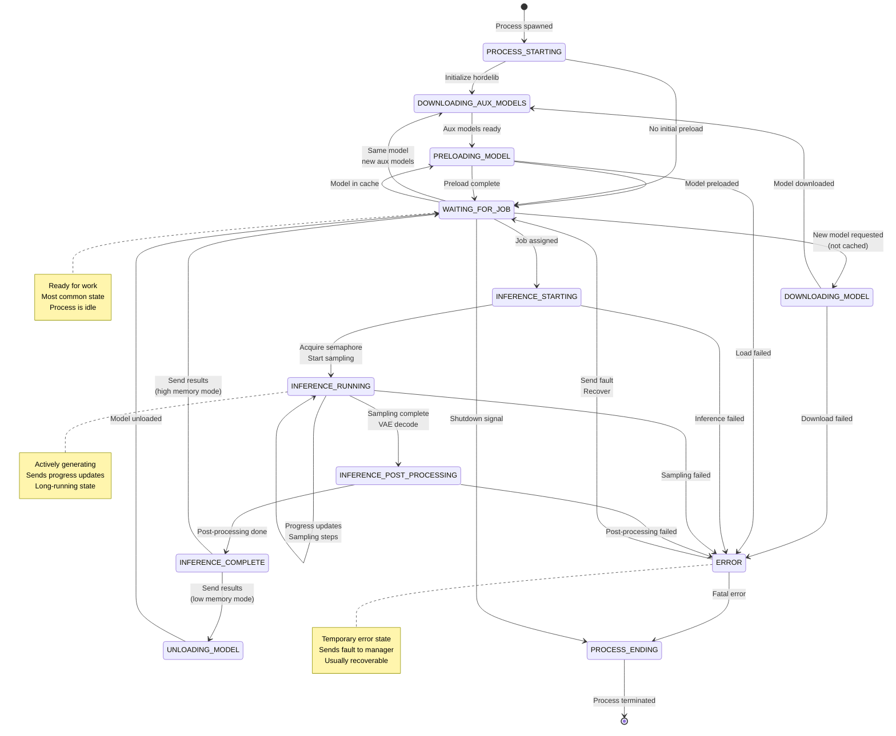
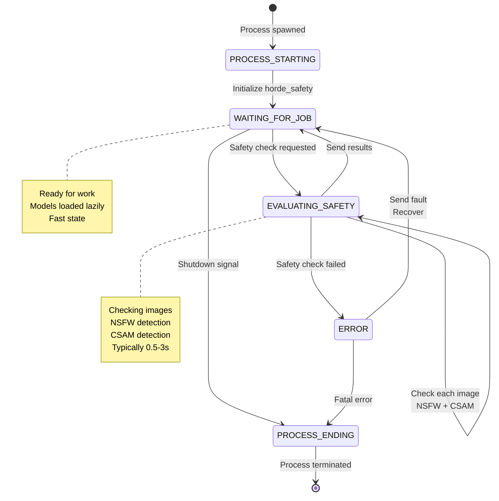
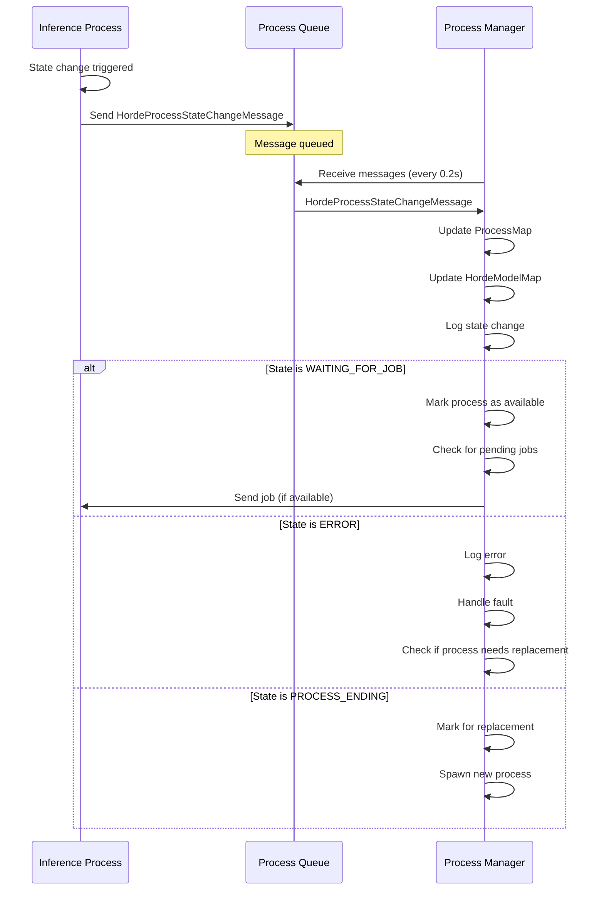
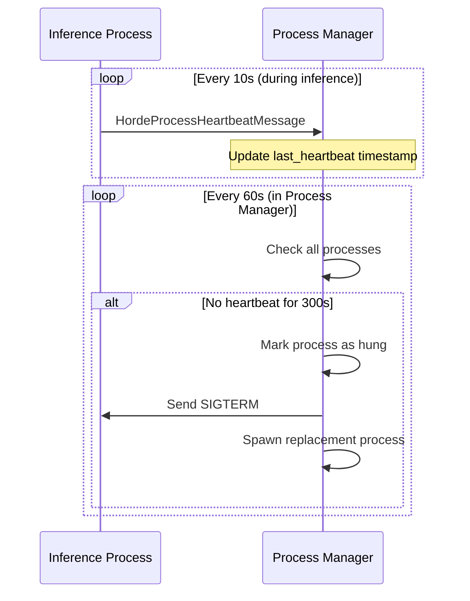
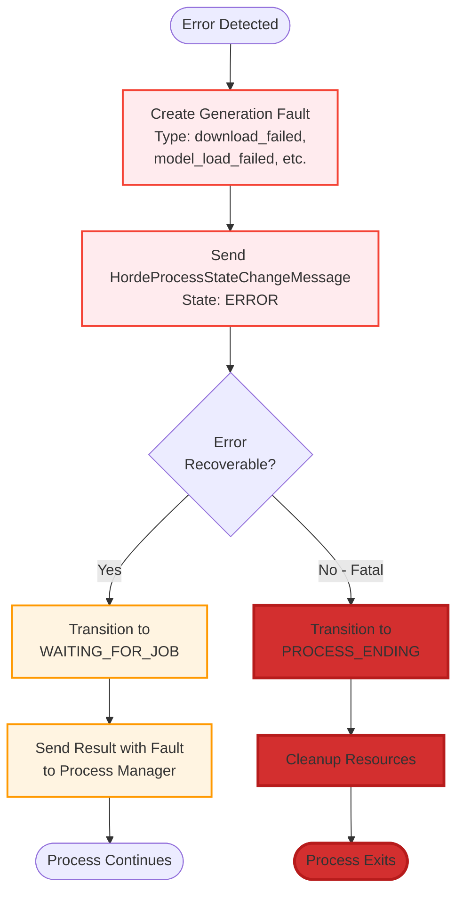

# Level 4: Process State Machine

This diagram shows the detailed state machine for inference and safety processes, including all possible states and transitions.

**Primary Files**:
- State Definitions: `messages.py` (`HordeProcessState` enum)
- State Management: `horde_process.py` (`HordeProcess` base class)
- Inference States: `inference_process.py`
- Safety States: `safety_process.py`

## Inference Process State Machine



## Safety Process State Machine



## State Definitions

**HordeProcessState Enum** (`messages.py`):

```python
class HordeProcessState(str, Enum):
    """All possible process states"""

    # Lifecycle states
    PROCESS_STARTING = "process_starting"
    PROCESS_ENDING = "process_ending"
    PROCESS_ENDED = "process_ended"

    # Idle state
    WAITING_FOR_JOB = "waiting_for_job"

    # Model loading states
    DOWNLOADING_MODEL = "downloading_model"
    DOWNLOADING_AUX_MODELS = "downloading_aux_models"
    PRELOADING_MODEL = "preloading_model"
    UNLOADING_MODEL = "unloading_model"

    # Inference states
    INFERENCE_STARTING = "inference_starting"
    INFERENCE_RUNNING = "inference_running"
    INFERENCE_POST_PROCESSING = "inference_post_processing"
    INFERENCE_COMPLETE = "inference_complete"

    # Safety states
    EVALUATING_SAFETY = "evaluating_safety"

    # Error state
    ERROR = "error"
```

## State Transitions

### State Change Message Flow



## State Durations

**Typical State Durations** (varies by job):

| State | Typical Duration | Notes |
|-------|------------------|-------|
| PROCESS_STARTING | 5-15s | One-time startup |
| WAITING_FOR_JOB | 0-300s | Varies by queue depth |
| DOWNLOADING_MODEL | 30-90s | First time only |
| DOWNLOADING_AUX_MODELS | 2-10s | Per LoRA/TI set |
| PRELOADING_MODEL | 10-40s | Cached model load |
| INFERENCE_STARTING | 0.1-1s | Setup time |
| INFERENCE_RUNNING | 10-120s | Main work |
| INFERENCE_POST_PROCESSING | 2-20s | VAE + upscale |
| INFERENCE_COMPLETE | 0.1-0.5s | Cleanup |
| UNLOADING_MODEL | 1-3s | If needed |
| EVALUATING_SAFETY | 0.5-3s | Fast |
| ERROR | 0.1-1s | Immediate |
| PROCESS_ENDING | 0.5-2s | Cleanup |

## State Tracking in Process Manager

**ProcessMap Data Structure**:

```python
class ProcessMap:
    """Tracks all child processes and their states"""

    def __init__(self):
        self.inference_processes: list[HordeProcessInfo] = []
        self.safety_processes: list[HordeProcessInfo] = []
        self.all_processes: dict[int, HordeProcessInfo] = {}

class HordeProcessInfo:
    """Information about a single process"""

    process_id: int
    process_handle: multiprocessing.Process
    pipe_connection: Connection           # For sending commands
    process_queue: ProcessQueue           # For receiving messages
    process_type: "inference" | "safety"

    # State tracking
    process_state: HordeProcessState
    last_state_change: float              # Timestamp
    last_heartbeat: float                 # Timestamp

    # Job tracking
    current_job_id: str | None
    jobs_completed: int

    # Performance tracking
    total_inference_time: float
    average_job_time: float
    memory_usage: int                     # Bytes
```

**State Queries**:

```python
# Check if process is available for work
def is_available(process_info: HordeProcessInfo) -> bool:
    return process_info.process_state == HordeProcessState.WAITING_FOR_JOB

# Check if process is doing inference
def is_busy(process_info: HordeProcessInfo) -> bool:
    return process_info.process_state in [
        HordeProcessState.INFERENCE_STARTING,
        HordeProcessState.INFERENCE_RUNNING,
        HordeProcessState.INFERENCE_POST_PROCESSING,
    ]

# Check if process is loading a model
def is_loading_model(process_info: HordeProcessInfo) -> bool:
    return process_info.process_state in [
        HordeProcessState.DOWNLOADING_MODEL,
        HordeProcessState.DOWNLOADING_AUX_MODELS,
        HordeProcessState.PRELOADING_MODEL,
    ]

# Check if process is hung (no heartbeat)
def is_hung(process_info: HordeProcessInfo) -> bool:
    time_since_heartbeat = time.time() - process_info.last_heartbeat
    return time_since_heartbeat > HEARTBEAT_TIMEOUT  # 300s
```

## Heartbeat Mechanism

**Purpose**: Detect hung processes



**Heartbeat Message**:
```python
class HordeProcessHeartbeatMessage:
    process_id: int
    current_state: HordeProcessState
    current_job_id: str | None
    progress: float                    # 0.0 - 1.0 (for inference)
    memory_usage: int                  # Bytes
```

**Heartbeat Intervals**:
- **During inference**: Every 10s (or every N steps)
- **While idle**: Every 60s
- **Timeout**: 300s (5 minutes)

## Error Handling and Recovery

**Error State Flow**:



**Recoverable Errors**:
- Download failed (retry possible)
- Model load failed (can try different model)
- Inference timeout (rare, but can continue)
- Safety check failed (can skip and submit fault)

**Fatal Errors**:
- Out of memory (CUDA OOM)
- GPU device lost
- Corrupted model files
- Process crash

**Process Manager Response**:
```python
def handle_error_state(process_info: HordeProcessInfo, error_msg: str):
    # Log error
    logger.error(f"Process {process_info.process_id} error: {error_msg}")

    # Check if process is recovering
    if process_info.process_state == HordeProcessState.WAITING_FOR_JOB:
        # Recovered, continue using process
        return

    # Check if process is ending
    if process_info.process_state == HordeProcessState.PROCESS_ENDING:
        # Mark for replacement
        replace_process(process_info)
        return

    # Check if hung (no state change for 300s)
    if is_hung(process_info):
        # Force kill and replace
        process_info.process_handle.terminate()
        replace_process(process_info)
```

## Process Lifecycle

**Complete Lifecycle**:

```mermaid
flowchart LR
    Start([Process Manager]) --> Spawn[Spawn Process<br/>multiprocessing.Process]

    Spawn --> Init[Process: __init__<br/>State: PROCESS_STARTING]

    Init --> Setup[Initialize Libraries<br/>hordelib/horde_safety]

    Setup --> Ready[State: WAITING_FOR_JOB]

    Ready --> Work{Work Loop}

    Work -->|Job Received| Process[Process Job]
    Process --> Work

    Work -->|Shutdown Signal| Shutdown[State: PROCESS_ENDING]

    Shutdown --> Cleanup[Cleanup Resources<br/>Unload Models]

    Cleanup --> Exit[State: PROCESS_ENDED]

    Exit --> End([Process Exits])

    classDef start fill:#e1f5ff,stroke:#0066cc,stroke-width:2px
    classDef ready fill:#e8f5e9,stroke:#4caf50,stroke-width:2px
    classDef work fill:#fff4e1,stroke:#ff9900,stroke-width:2px
    classDef end fill:#ffebee,stroke:#f44336,stroke-width:2px

    class Spawn,Init,Setup start
    class Ready ready
    class Work,Process work
    class Shutdown,Cleanup,Exit,End end
```

**Startup Time**:
- Spawn process: 0.5-2s
- Initialize hordelib: 3-10s
- **Total**: 3.5-12s

**Shutdown Time**:
- Unload models: 1-3s
- Cleanup: 0.5-1s
- **Total**: 1.5-4s

## Configuration

**Process Settings** (`bridgeData.yaml`):
```yaml
# Process counts
max_inference_processes: 2
max_safety_processes: 1

# Timeouts
process_startup_timeout: 60        # Max time for startup
heartbeat_timeout: 300             # Max time without heartbeat
preload_timeout: 300               # Max time for model preload
inference_timeout: 600             # Max time for inference
safety_timeout: 30                 # Max time for safety check
```

## Key Files

**State Management**:
- `messages.py`: State enum definitions
- `horde_process.py`: Base class with state tracking
- `process_manager.py`: State monitoring and transitions

**Process Types**:
- `inference_process.py`: Inference process states
- `safety_process.py`: Safety process states

## Related Diagrams

**Used In**:
- [Level 3: Inference Flow](../level-3-hot-paths/inference-flow.md)
- [Level 3: Safety Check Flow](../level-3-hot-paths/safety-check-flow.md)

**See Also**:
- [Level 4: Inter-Process Communication](inter-process-communication.md)
- [Level 4: Model Management](model-management.md)
