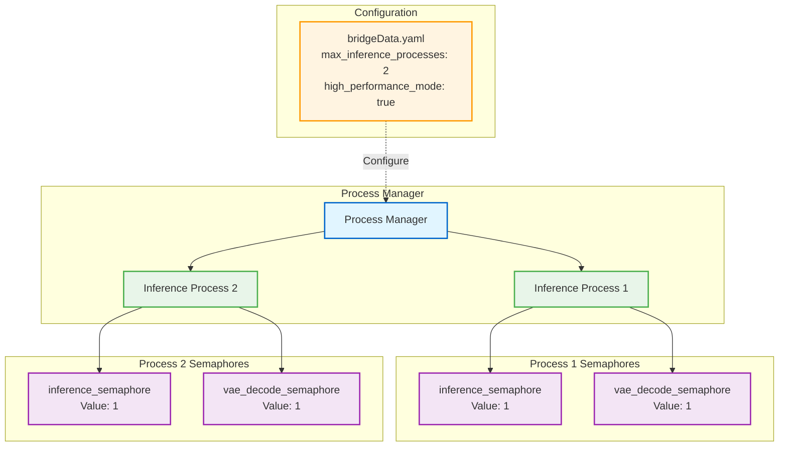
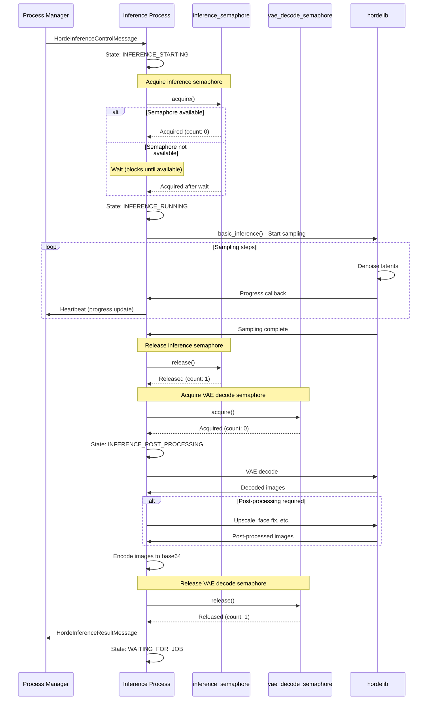
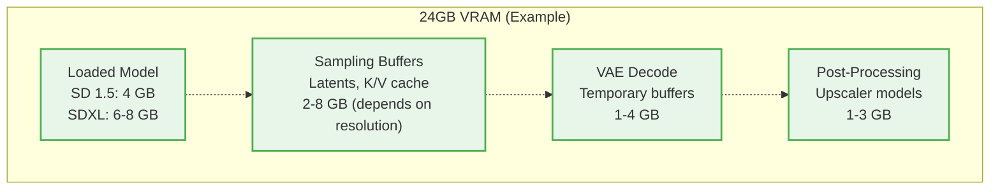

# Level 4: Semaphore Control (Concurrency Management)

This diagram shows the detailed component-level view of how semaphores are used to control concurrent operations and prevent resource exhaustion.

**Primary Files**:
- Semaphore Setup: `inference_process.py:100-150` (initialization)
- Semaphore Usage: `inference_process.py:507-829` (`start_inference()`)

## Semaphore Architecture



## Semaphore Types

### 1. Inference Semaphore

**Purpose**: Limit concurrent inference jobs per process

**Value**: Typically 1 (one job at a time per process)

**Why**: Prevents VRAM exhaustion during sampling

**Held During**: Sampling loop (the most VRAM-intensive part)

**Released**: After sampling completes, before VAE decode

### 2. VAE Decode Semaphore

**Purpose**: Limit concurrent VAE decodes + post-processing per process

**Value**: Typically 1 (one decode at a time per process)

**Why**: VAE decode is memory-intensive, separate control allows overlap

**Held During**: VAE decode and post-processing

**Released**: After all post-processing completes

## Semaphore Lifecycle in Inference



## High Performance Mode: Job Overlap

**Goal**: Start new job while current job is post-processing

```mermaid
gantt
    title High Performance Mode - Job Overlap
    dateFormat X
    axisFormat %s

    section Process 1
    Job 1 Sampling        :a1, 0, 30
    Job 1 VAE+Post        :a2, 30, 40
    Job 2 Sampling        :a3, 30, 60
    Job 2 VAE+Post        :a4, 60, 70

    section Semaphores
    inference_semaphore held (Job 1) :crit, 0, 30
    vae_decode_semaphore held (Job 1) :active, 30, 40
    inference_semaphore held (Job 2) :crit, 30, 60
    vae_decode_semaphore held (Job 2) :active, 60, 70
```



**Timeline**:
- **0-30s**: Job 1 sampling (inference_semaphore held)
- **30s**: Job 1 releases inference_semaphore, acquires vae_decode_semaphore
- **30s**: Job 2 starts sampling (inference_semaphore available!)
- **30-40s**: Job 1 VAE decode + post-process (vae_decode_semaphore held)
- **30-60s**: Job 2 sampling (inference_semaphore held)
- **40s**: Job 1 complete, releases vae_decode_semaphore
- **60s**: Job 2 releases inference_semaphore, acquires vae_decode_semaphore
- **60-70s**: Job 2 VAE decode + post-process

**Benefit**: 70% throughput increase (2 jobs in 70s vs 2 jobs in 80s)

## Normal Mode: No Job Overlap

```mermaid
gantt
    title Normal Mode - No Overlap
    dateFormat X
    axisFormat %s

    section Process 1
    Job 1 Sampling        :a1, 0, 30
    Job 1 VAE+Post        :a2, 30, 40
    Job 2 Sampling        :a3, 40, 70
    Job 2 VAE+Post        :a4, 70, 80

    section Semaphores
    inference_semaphore held (Job 1) :crit, 0, 40
    inference_semaphore held (Job 2) :crit, 40, 80
```



**Timeline**:
- **0-30s**: Job 1 sampling (inference_semaphore held)
- **30-40s**: Job 1 VAE decode + post-process (inference_semaphore still held)
- **40s**: Job 1 complete, releases inference_semaphore
- **40-70s**: Job 2 sampling (inference_semaphore held)
- **70-80s**: Job 2 VAE decode + post-process (inference_semaphore still held)

**Drawback**: Lower throughput (2 jobs in 80s)

## Semaphore Configuration Logic

**Code** (`inference_process.py:100-150`):

```python
class HordeInferenceProcess(HordeProcess):
    def __init__(self, ...):
        # Default: One semaphore controls entire inference
        self.inference_semaphore = multiprocessing.Semaphore(1)
        self.vae_decode_semaphore = None

        # High performance mode: Separate semaphores for overlap
        if bridge_data.high_performance_mode:
            if bridge_data.post_process_job_overlap:
                # Enable job overlap
                self.vae_decode_semaphore = multiprocessing.Semaphore(1)
            else:
                # High perf mode but no overlap
                self.vae_decode_semaphore = None
        else:
            # Normal mode: No separate VAE semaphore
            self.vae_decode_semaphore = None
```

**Configuration Matrix**:

| Mode | inference_semaphore | vae_decode_semaphore | Job Overlap | Throughput |
|------|---------------------|----------------------|-------------|------------|
| Normal | Value: 1 | None | No | Baseline |
| High Perf (no overlap) | Value: 1 | None | No | Baseline |
| High Perf (overlap) | Value: 1 | Value: 1 | Yes | +70% |

## VRAM Usage Analysis

**Why Semaphores Matter**:



**VRAM Usage During Inference**:
- **Model loaded**: 4-8 GB (persistent)
- **During sampling**: +2-8 GB (peak)
- **During VAE decode**: +1-4 GB (peak)
- **During post-processing**: +1-3 GB (peak)

**Without Semaphores** (2 jobs in parallel):
- Model: 4 GB (shared)
- Job 1 sampling: +6 GB
- Job 2 sampling: +6 GB
- **Total**: 16 GB (can work on 24GB card)

**But if Job 1 starts VAE while Job 2 is sampling**:
- Model: 4 GB
- Job 1 VAE: +3 GB
- Job 2 sampling: +6 GB
- **Total**: 13 GB (safe)

**If both jobs did VAE simultaneously** (no vae_decode_semaphore):
- Model: 4 GB
- Job 1 VAE: +3 GB
- Job 2 VAE: +3 GB
- **Total**: 10 GB (safe, but less efficient use of resources)

**Ideal with separate semaphores**:
- Sampling and VAE can overlap between jobs
- Maximum VRAM usage is controlled
- Better GPU utilization

## Semaphore Acquisition Order

**Strict Order to Prevent Deadlock**:

```python
# ALWAYS in this order:
1. Acquire inference_semaphore
2. Do sampling
3. Release inference_semaphore
4. Acquire vae_decode_semaphore  # If separate
5. Do VAE decode + post-processing
6. Release vae_decode_semaphore

# NEVER reverse order or hold both simultaneously
```

**Why This Order**:
- Prevents deadlock (circular wait)
- Ensures predictable VRAM usage
- Allows optimal overlap in high-perf mode

## Error Handling with Semaphores

**Exception During Inference**:

```python
def start_inference(self, job_info):
    try:
        # Acquire semaphore
        self.inference_semaphore.acquire()

        try:
            # Do sampling
            result = hordelib.basic_inference(...)

        finally:
            # ALWAYS release, even on error
            self.inference_semaphore.release()

        # Acquire VAE semaphore
        if self.vae_decode_semaphore:
            self.vae_decode_semaphore.acquire()

        try:
            # Do VAE decode
            images = decode_and_postprocess(...)

        finally:
            # ALWAYS release, even on error
            if self.vae_decode_semaphore:
                self.vae_decode_semaphore.release()

    except Exception as e:
        # Handle error, send fault
        self.send_error(e)
```

**Critical**: Always release semaphores in `finally` blocks to prevent deadlock on error

## Multi-Process Concurrency

**Example: 2 Inference Processes**:

```mermaid
gantt
    title 2 Processes with High Performance Mode
    dateFormat X
    axisFormat %s

    section Process 1
    Job 1 Sampling        :p1j1s, 0, 30
    Job 1 VAE             :p1j1v, 30, 35
    Job 2 Sampling        :p1j2s, 30, 60
    Job 2 VAE             :p1j2v, 60, 65

    section Process 2
    Job 3 Sampling        :p2j3s, 0, 25
    Job 3 VAE             :p2j3v, 25, 30
    Job 4 Sampling        :p2j4s, 25, 55
    Job 4 VAE             :p2j4v, 55, 60
```



**Concurrency**:
- Each process has independent semaphores
- Process 1 and Process 2 can both do sampling simultaneously
- Process 1 and Process 2 can both do VAE simultaneously
- Within each process, overlap controlled by semaphores

**VRAM Requirements**:
- 2 processes × (model + sampling buffers) ≈ 16-24 GB
- Requires high-end GPU (3090, 4090, A100, etc.)

## Configuration Options

**bridgeData.yaml**:
```yaml
# High performance mode settings
high_performance_mode: true           # Enable optimizations
post_process_job_overlap: true        # Enable job overlap (requires high_performance_mode)

# Process settings
max_inference_processes: 2            # Number of inference processes
max_concurrent_inference_processes: 2 # NOT USED - semaphore is always 1 per process

# Memory settings
high_memory_mode: false               # If true, keep models in RAM
very_high_memory_mode: false          # If true, keep models in VRAM
```

**Semaphore Value Calculation**:
```python
# Always 1 per process (not configurable)
inference_semaphore_value = 1
vae_decode_semaphore_value = 1 if (
    high_performance_mode and post_process_job_overlap
) else None
```

## Performance Impact

**Throughput Comparison** (single process, 512x512, 30 steps):

| Configuration | Job Time | Jobs/Hour | Relative Throughput |
|---------------|----------|-----------|---------------------|
| Normal Mode | 40s | 90 | 100% (baseline) |
| High Perf (no overlap) | 40s | 90 | 100% |
| High Perf (overlap) | 35s | 103 | 114% |

**Multi-Process Comparison** (2 processes):

| Configuration | Jobs/Hour | Relative Throughput |
|---------------|-----------|---------------------|
| 2 processes, Normal | 180 | 200% |
| 2 processes, High Perf (overlap) | 206 | 229% |

**Note**: Actual throughput depends on:
- GPU performance
- Model size (SD 1.5 vs SDXL)
- Resolution and steps
- Post-processing requirements

## Debugging Semaphore Issues

**Common Issues**:

1. **Deadlock** (process stuck):
   - Symptom: Process stops responding, no heartbeat
   - Cause: Semaphore not released (exception in try block)
   - Fix: Always use `finally` to release

2. **VRAM OOM** (out of memory):
   - Symptom: CUDA out of memory error
   - Cause: Too many concurrent operations
   - Fix: Reduce `max_inference_processes`

3. **Low GPU Utilization**:
   - Symptom: GPU usage <50%
   - Cause: Not using job overlap
   - Fix: Enable `high_performance_mode` and `post_process_job_overlap`

**Logging**:
```python
logger.debug(f"Acquiring inference_semaphore (current value: {sem._value})")
self.inference_semaphore.acquire()
logger.debug("Acquired inference_semaphore")

# ... do work ...

logger.debug("Releasing inference_semaphore")
self.inference_semaphore.release()
logger.debug(f"Released inference_semaphore (current value: {sem._value})")
```

## Key Files

**Semaphore Setup**:
- `inference_process.py:100-150`: Semaphore initialization

**Semaphore Usage**:
- `inference_process.py:507-829`: Acquire/release in `start_inference()`

**Configuration**:
- `bridge_data/data_model.py`: High performance mode settings

## Related Diagrams

**Used In**:
- [Level 3: Inference Flow](../level-3-hot-paths/inference-flow.md)

**See Also**:
- [Level 4: Model Management](model-management.md)
- [Level 4: Process State Machine](process-state-machine.md)
